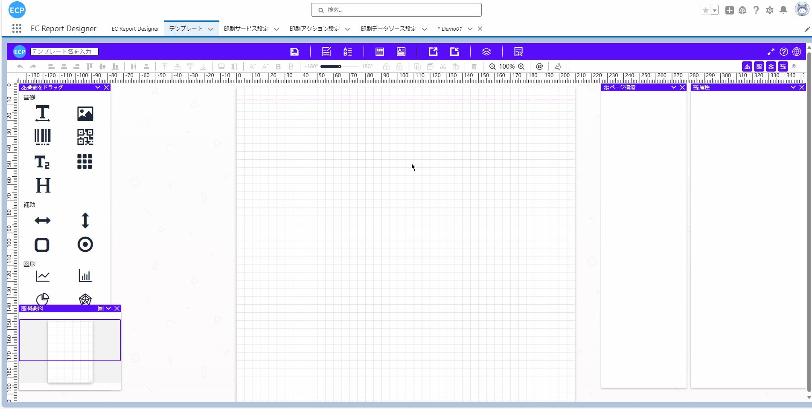
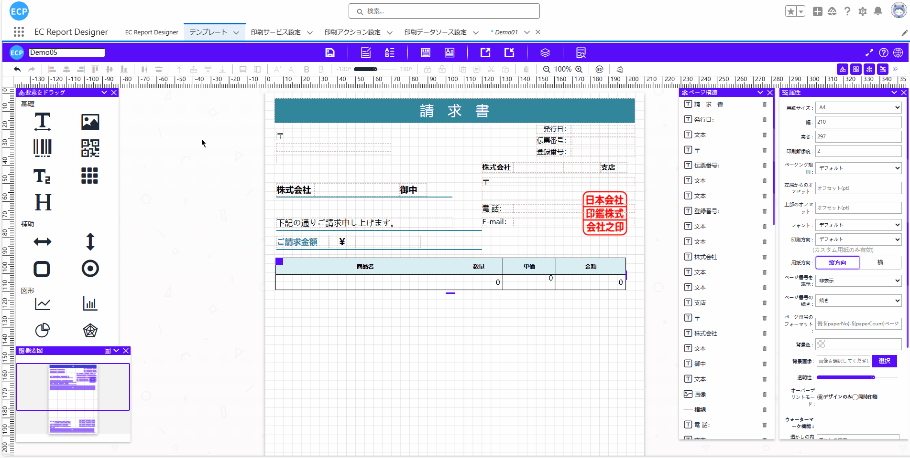
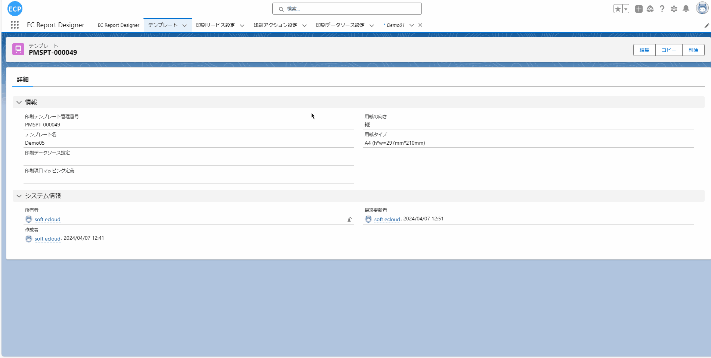
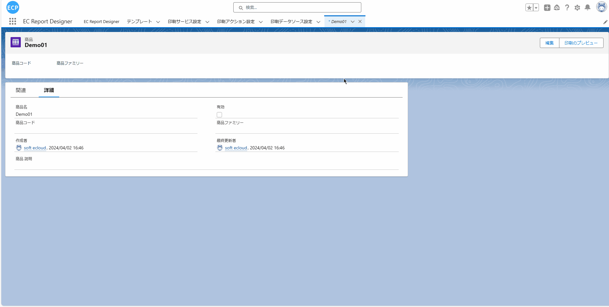

# 自定义换行打印

<aside>
💡 自定义换行打印功能允许用户在设计账票时灵活控制表格内数据的显示方式。当数据过长时，系统会自动将内容进行换行显示，确保长文本或大段文字能够完整展示在单元格中。用户也可以选择将表格列的单元格内容显示方式修改为省略，这样超出单元格长度的部分内容会被隐藏，而不会影响表格的行高。设计完成后，用户可以通过设置预览打印按钮，在对象中查看表格字段的显示或隐藏效果。
</aside>
 

# **前提条件：**

- Salesforce AppExchange 中查找我们的应用并安装到环境中。如下图所示：

# **1. 打开设计器**

- 1.1 通过Home Tab的快速开始、新建模板数据或者编辑下方既存模板的方式打开设计器。如下图所示：

# **2. 打开模板中心**

- 2.1 点击模板中读取一个带表格的模板到设计器或者新建一个模板。如下图所示：

# **3. 修改表格列的单元格内容显示方式属性值**

- 3.1 将表格其中一列的单元格内容显示方式设置为隐藏。如下图所示：

# **4. 输入模板名并保存模板**

- 4.1 输入模板名称，可以点击上方的保存按钮或使用快捷键(Ctrl / Command + S)将当前模板保存。如下图所示：

# **5. 查看保存的模板**

- 5.1 保存成功后可以点击模板Tab，将"最近查看的数据（固定列表）"修改为"全选"后即可查看到保存的模板。如下图所示：

# **6. 预览打印设置**

- 6.1 请参照[预览打印、直接打印](ad-print.md)的 1~3步骤。

# **7. 选择Object**

- 7.1 预览打印设置完成后，点击预想抽取数据到模板的Object(当前演示使用的是Demo01)，选择一笔数据查看详细信息。如下图所示：

# **8. 预览打印**

- 8.1 点击详细画面的预览打印按钮会弹出新窗口显示之前选定的模板。如下图所示：
注：打印需要确保已经连接了打印客户端，如没有连接可先看[预览打印、直接打印](ad-print.md)的步骤7

