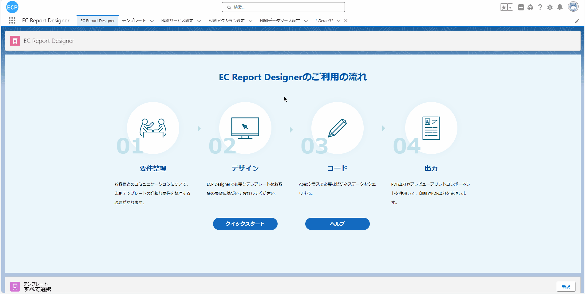
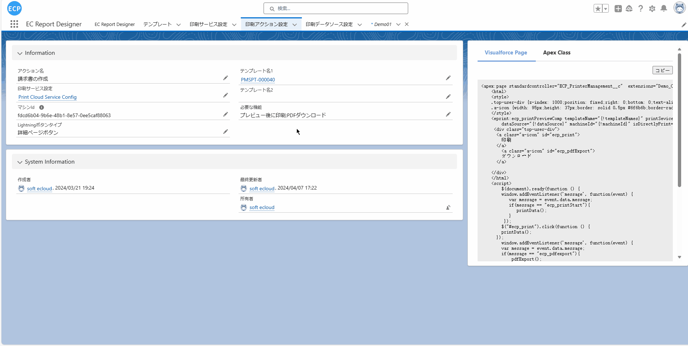
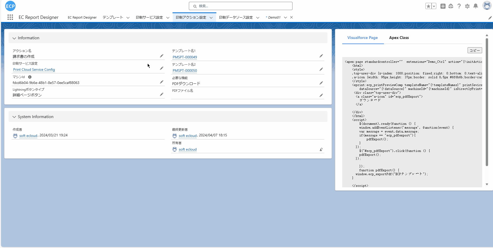

# 生成PDF、作为附件发送

<aside>
💡 生成PDF并作为附件发送功能允许用户在设计器中完成模板设计后，选择数据源对象并通过预览按钮生成PDF文件。用户首先设计完成模板的布局和内容，然后选择数据源对象以确定模板所要展示的数据来源。接着，用户可以点击预览按钮，系统会根据选择的数据源对象提取相应的数据，并填充到模板中进行预览。在预览界面上，用户可以选择生成PDF的操作，系统会将预览的内容转换为PDF格式，并下载。
</aside>
 

# **前提条件：**

- Salesforce AppExchange 中查找我们的应用并安装到环境中。如下图所示：

# **1. 打印操作设置**

- 1.1 打开应用后选择打印操作设置，编辑一条数据或新建一条数据。如下图所示：

- 1.2 通过编辑打开一条数据后可以修改打印操作设置，选择两个模板后必要的功能中只保留PDF下载。设置完成后点击保存此时右侧的示例代码会根据最新的设定刷新。如下图所示：

# **2. 预览按钮设置**

- 2.1 请参照[预览打印、直接打印](ad-print.md)的 2~3步骤。

# **3. 选择Object**

- 3.1 预览按钮设置完成后，点击预想抽取数据到模板的Object(当前演示使用的是Demo01)，选择一笔数据查看详细信息，商品 説明中存放的是预览时模板抽取的数据。如下图所示：

# **4. 预览下载PDF**

- 4.1 点击详细画面的预览按钮会弹出新窗口显示之前选定的模板，点击下载会将当前预览的模板包含数据下载为PDF。如下图所示：

TODO 作为附件发送暂时不补充，等待此功能修改后继续对应
