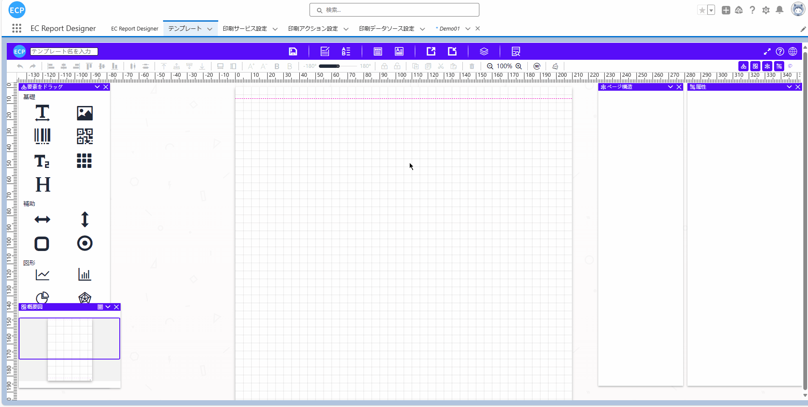
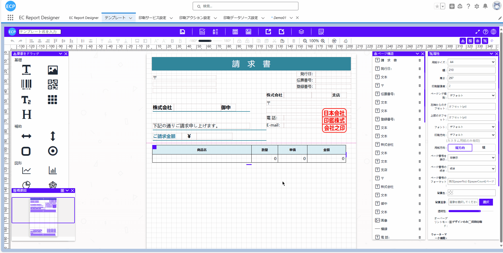
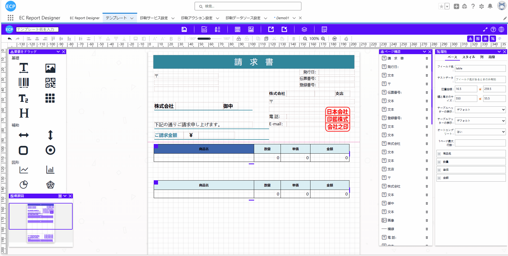
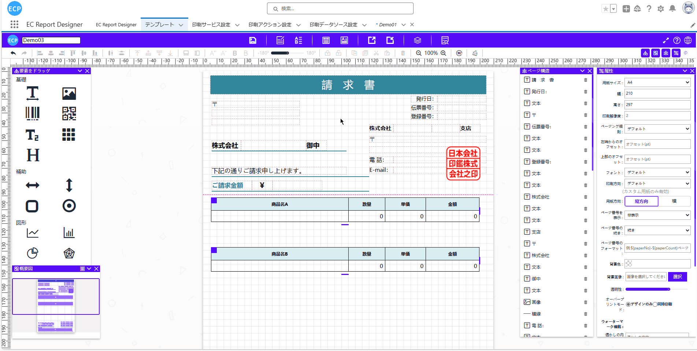
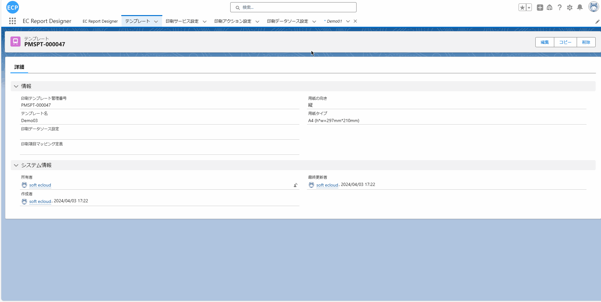
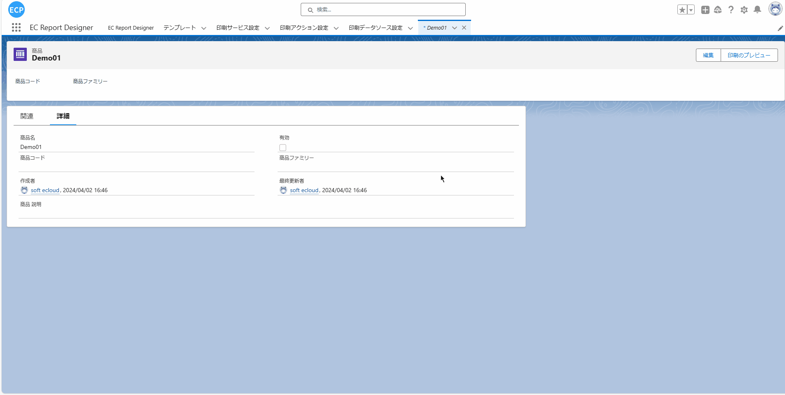

# 多表格打印

<aside>
💡 多表格打印功能允许在一个报表中使用多种不同的数据源进行预览打印。用户可以在账票设计器中拖拽多个表格到面板中，并为每个表格设置不同的字段以对应不同的数据源。完成设置后，用户可以设置预览打印按钮，以在对象中通过预览打印按钮查看多表格的模板。
</aside>
 

# **前提条件：**

- Salesforce AppExchange 中查找我们的应用并安装到环境中。如下图所示：

# **1. 打开设计器**

- 1.1 通过Home Tab的快速开始、新建模板数据或者编辑下方既存模板的方式打开设计器。如下图所示：

# **2. 打开模板中心**

- 2.1 点击模板中读取一个带表格的模板到设计器或者新建一个模板。如下图所示：

# **3. 复制粘贴一个表格**

- 3.1 点击表格使用上方的工具按钮复制粘贴一个表格。如下图所示：

# **4. 修改表格的字段属性**

- 4.1 修改两个表格的字段属性，确保两个表格的字段属性不一致用于区分。如下图所示：

# **5. 输入模板名并保存模板**

- 5.1 输入模板名称，可以点击上方的保存按钮或使用快捷键(Ctrl / Command + S)将当前模板保存。如下图所示：

# **6. 查看保存的模板**

- 6.1 保存成功后可以点击模板Tab，将"最近查看的数据（固定列表）"修改为"全选"后即可查看到保存的模板。如下图所示：

# **7. 预览打印设置**

- 7.1 请参照[预览打印、直接打印](ad-print.md)的 1~3步骤。

# **8. 选择Object**

- 8.1 预览打印设置完成后，点击预想抽取数据到模板的Object(当前演示使用的是Demo01)，选择一笔数据查看详细信息。如下图所示：

# **9. 预览打印**

- 9.1 点击详细画面的预览打印按钮会弹出新窗口显示之前选定的模板。如下图所示：
注：打印需要确保已经连接了打印客户端，如没有连接可先看[预览打印、直接打印](ad-print.md)的步骤7

