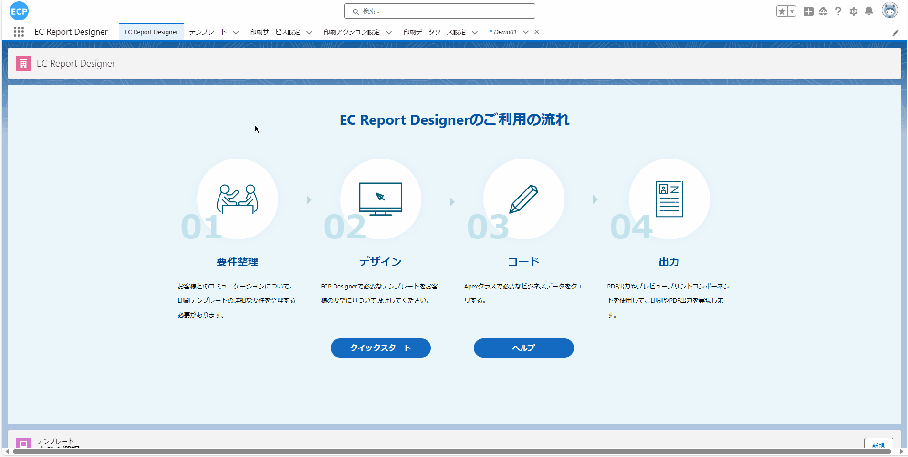
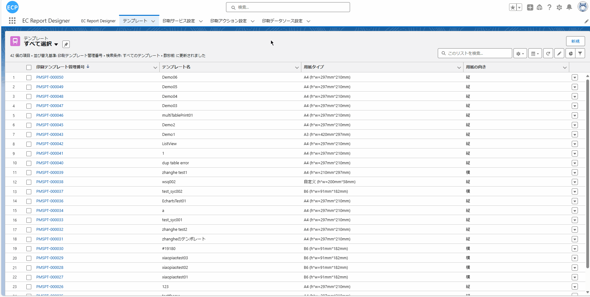
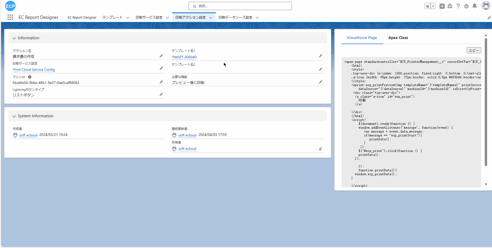
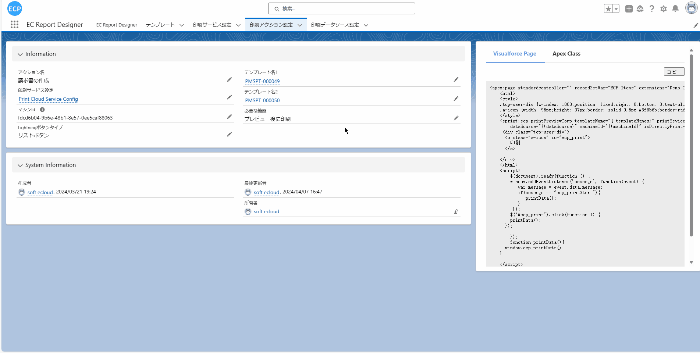
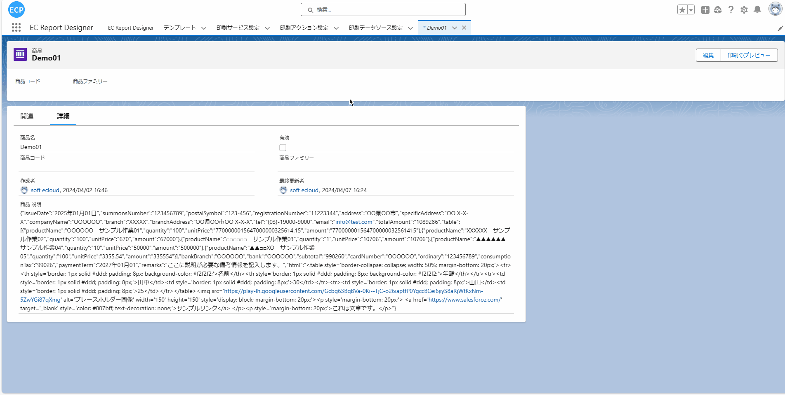

# 复数模板的打印

<aside>
💡 复数模板打印功能允许用户在打印操作中选择多个模板，并使用相同的数据源进行预览打印。用户可以在打印操作中选择多个设计好的模板，这些模板可以是不同的，但它们的数据源是相同的。在预览时，系统会从数据源中提取每个模板的数据然后进行展示。设计完成后，用户可以设置预览打印按钮，在对象中查看多个模板的打印效果，确保显示内容符合预期。
</aside>
 

# **前提条件：**

- Salesforce AppExchange 中查找我们的应用并安装到环境中。如下图所示：

# **1. 打印操作设置**

- 1.1 打开应用后选择模板查看模板数据如果已经创建了多个模板可以直接进行下一步或者可以优先创建多个不同的模板后进行下一步。如下图所示：

- 1.2 模板确定或创建后选择打印操作设置，编辑一条数据或新建一条数据。如下图所示：

- 1.3 通过编辑打开一条数据后可以修改打印操作设置，选择两个不同的模板后保存(当前使用已经创建完成的PMSPT-000049和PMSPT-000050模板演示)。如下图所示：

# **2. 预览打印按钮设置**

- 2.1 请参照[预览打印、直接打印](ad-print.md)的 2~3步骤。

# **3. 选择Object**

- 3.1 预览打印按钮设置完成后，点击预想抽取数据到模板的Object(当前演示使用的是Demo01)，选择一笔数据查看详细信息，商品 説明中存放的是预览时模板抽取的数据。如下图所示：

# **4. 预览打印**

- 4.1 点击详细画面的预览打印按钮会弹出新窗口显示之前选定的模板。如下图所示：
注：打印需要确保已经连接了打印客户端，如没有连接可先看[预览打印、直接打印](ad-print.md)的步骤7

