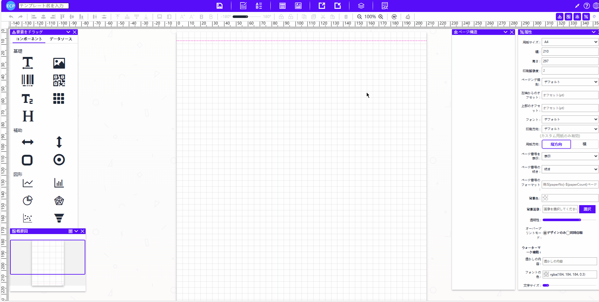
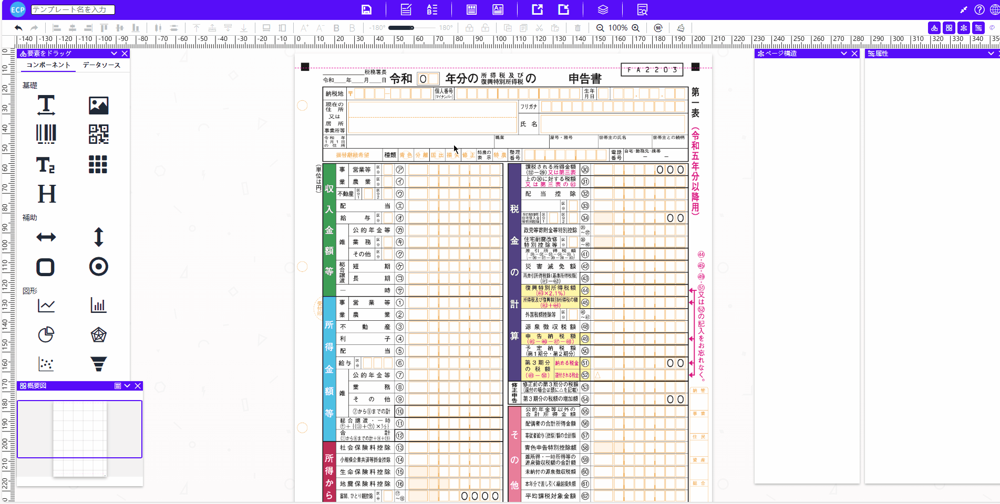
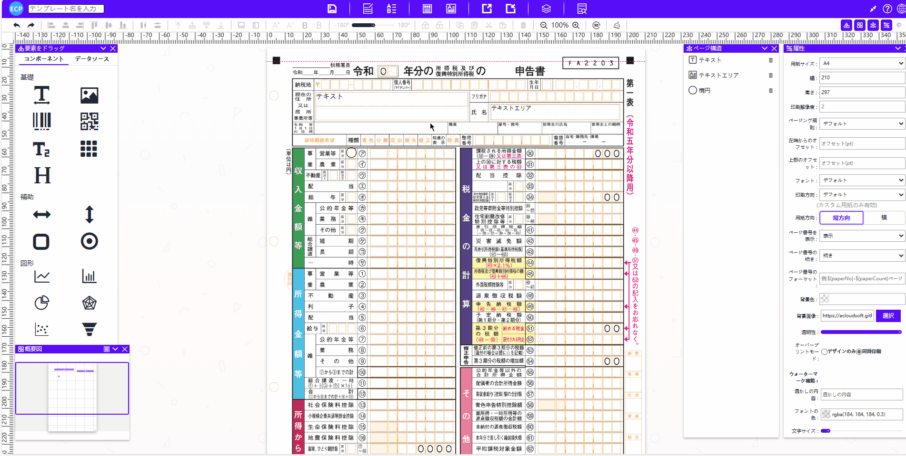
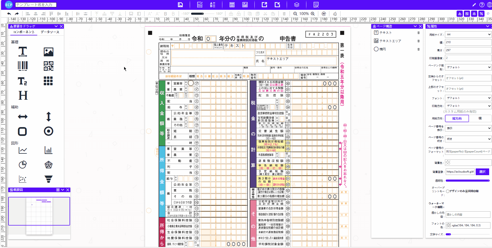
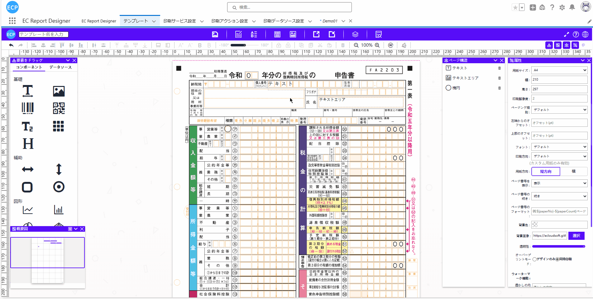
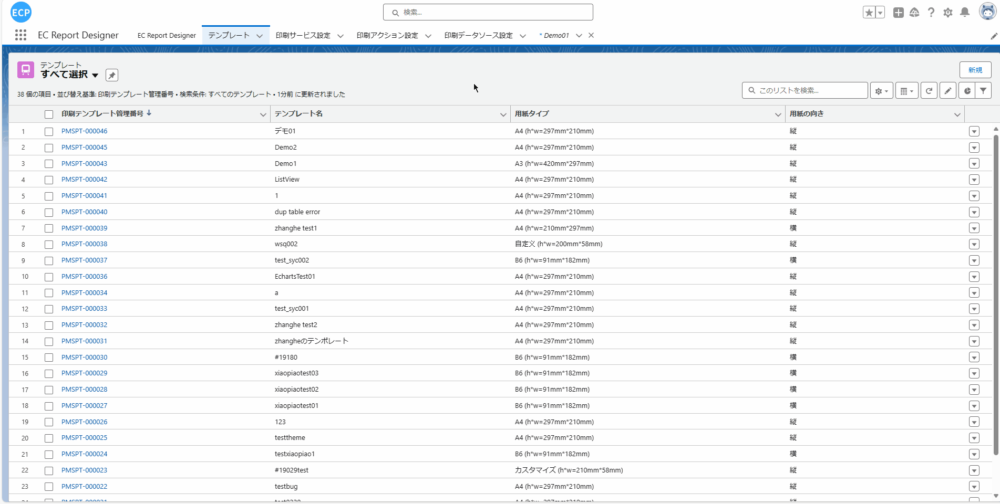

# 套打功能

# **前提条件：**

- Salesforce AppExchange 中查找我们的应用并安装到环境中。如下图所示：

# **1. 打开设计器**

- 1.1 通过Home Tab的快速开始或新建模板数据的方式打开设计器。如下图所示：

# **2. 上传套打的背景图**

- 2.1 点击面板在右侧的属性中找到背景图片，可以上传本地的图片也可以使用图片的连接。如下图所示：
注：本地上传图片最大支持512KB。

# **3. 套打的基础设置**

- 3.1 如果感觉背景图颜色看着比较透明可以将透明度设置到最大，想在预览和打印时可以看到背景图需要在面板属性中找到套打模式选择同时打印。如下图所示：

- 3.2 如果不需要页眉线和页脚线可以将页眉线拖到面板最上方，页脚线可以拖到面板最下方。如下图所示：

# **4. 在套打背景上添加元素**

- 4.1 完成套打背景设置之后，可以在套打的背景上自由添加各种元素。如下图所示：

# **5. 元素微调适应套打背景**

- 5.1 元素添加后有文字与表格对不上的情况可以修改元素属性中的数据。如下图所示：

# **6. 保存**

- 6.1 当模板全部设置完成后在左上角输入模板名后可以点击上方的保存按钮或使用快捷键(Ctrl / Command + S)将当前模板保存。如下图所示：

# **7. 查看保存的模板**

- 7.1 保存成功后可以点击模板Tab，将"最近查看的数据（固定列表）"修改为"全选"后即可查看到保存的模板。如下图所示：

# **8. 编辑模板**

- 8.1 点击编辑能再次在设计器中编辑该模板。如下图所示：

