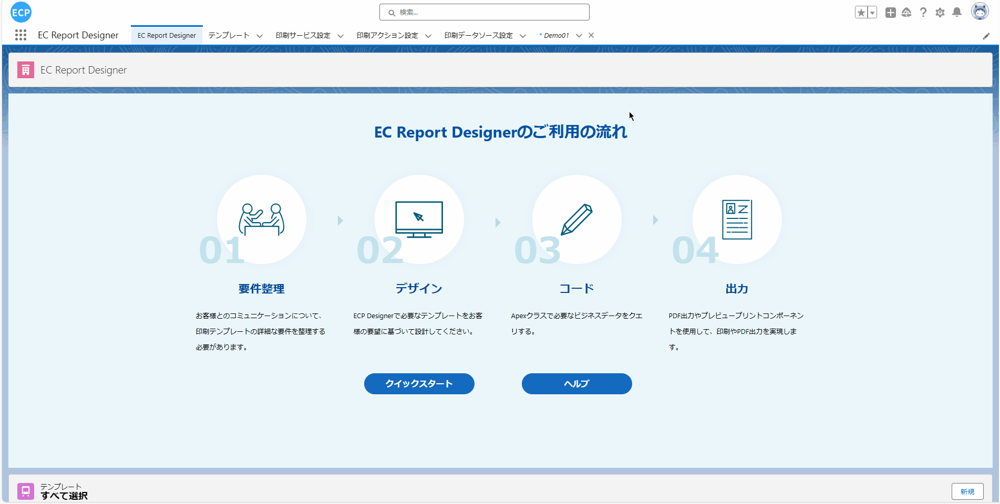
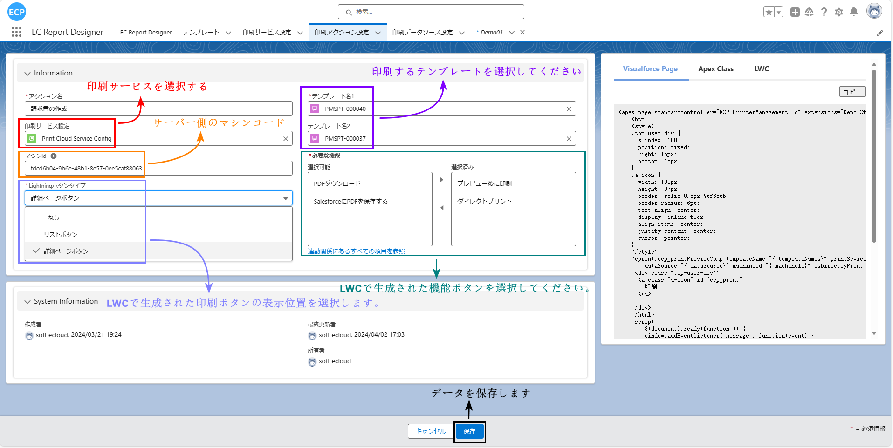
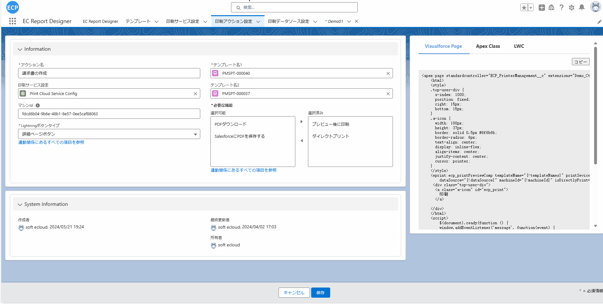
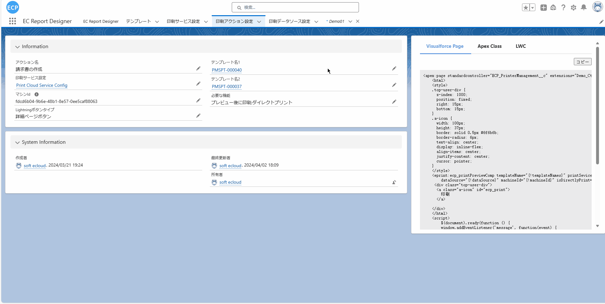
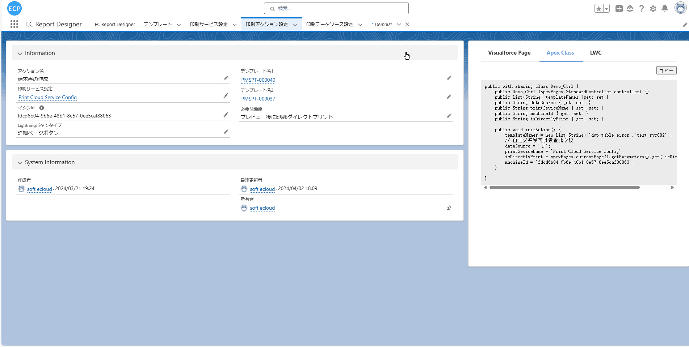
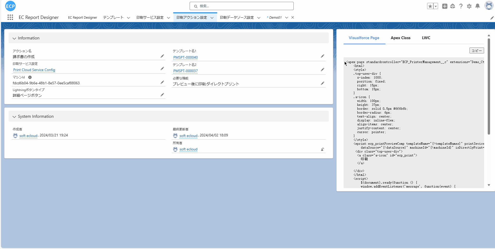
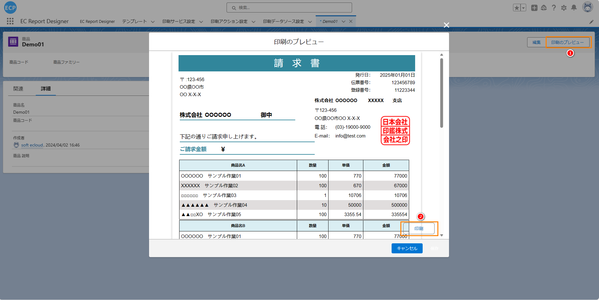
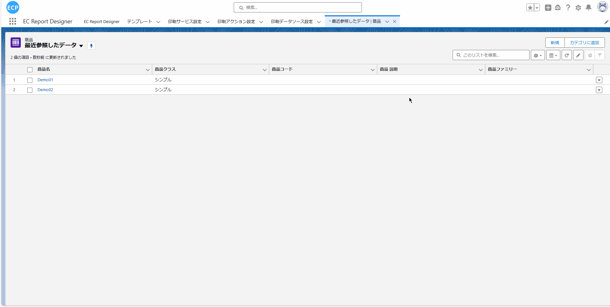
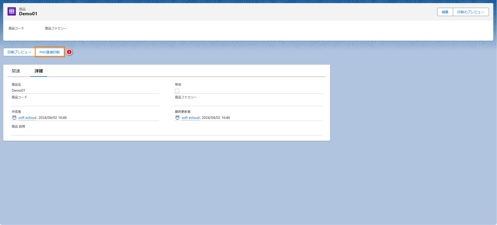

# 打印

# **前提条件：**

- Salesforce AppExchange 中查找我们的应用并安装到环境中。如下图所示：

# **1. 打印设置**

- 1.1 打开应用后选择打印动作设置，编辑一条数据或新建一条数据。如下图所示：

- 1.2 通过编辑打开一条数据后可以修改打印动作设置，设置完成后点击保存会将之前的设定数据保存。如下图所示：

- 1.3 保存成功后右侧的示例代码会根据最新的设定刷新。如下图所示：

# **2. 新建Apex Class、Visualforce Page、LWC**

- 2.1 创建一个新的Apex Class文件后点击复制将生成的示例代码复制到新建的Apex Class文件中。

- 2.2 创建一个新的Visualforce Page文件后点击复制将生成的示例代码复制到新建的Visualforce Page文件中。

- 2.3 通过VS Code工具创建一个新的LWC文件目录后点击复制将生成的示例代码复制到新建的LWC文件中。
TODO 暂时不考虑LWC

# **3. 预览打印设置**

- 3.1 代码添加完成后切换到需要打印的Object中添加预览打印按钮。如下图所示：

- 3.2 Object中的预览打印按钮添加完成后返回到Object画面将Object中的预览打印按钮添加到画面展示。如下图所示：

# **4. 预览打印**

- 4.1 点击详细画面的预览打印按钮会弹出新窗口显示之前选定的模板。如下图所示：
注：打印需要确保已经连接了打印客户端，如没有连接可先看步骤7

# **5. 直接打印设置**

- 5.1 在详细画面点击设置选择编辑画面，在编辑画面中将左侧新建的LWC拖拽至详细中后保存。如下图所示：

# **6. 直接打印**

- 6.1 在详细画面点击PMS直接打印即可实现静默打印。如下图所示：
注：打印需要确保已经连接了打印客户端，如没有连接可先看步骤7

# **7. 打印客户端设置**

- 7.1  软件安装。
- 7.2 [打印终端下载](download.md)
- 7.3 打印终端设置等说明请看[打印终端]()
