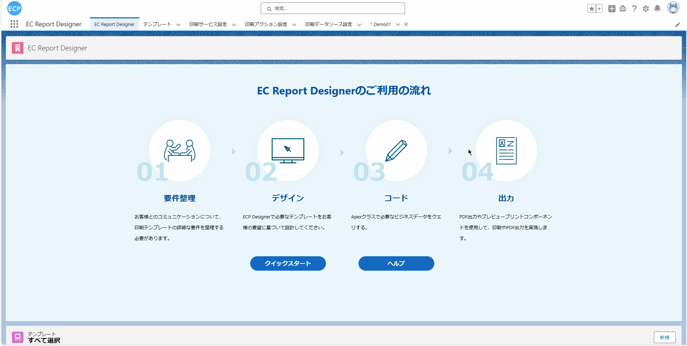

# 富文本框内容打印

<aside>
💡 富文本框内容打印功能允许用户在设计账票时将富文本内容包含在打印数据中，并在打印预览时以HTML格式自动显示。用户只需将一段HTML代码设置到打印数据中并将其绑定到富文本框，系统会自动将代码转换为HTML格式进行显示。在处理HTML数据时，用户需要注意将所有双引号修改为单引号，如果想要在数据中使用双引号可以用占位符&amp;quot;来代替。设计完成后，用户可以设置预览打印按钮，以在对象中查看富文本框显示的HTML内容，确保显示效果符合预期。
</aside>
 

# **前提条件：**

- Salesforce AppExchange 中查找我们的应用并安装到环境中。如下图所示：

# **1. 打开设计器**

- 1.1 通过Home Tab的快速开始、新建模板数据或者编辑下方既存模板的方式打开设计器。如下图所示：

# **2. 新建模板**

- 2.1 将HTML元素拖拽至面板中。如下图所示：

# **3. 设定HTML的字段属性**

- 3.1 设定HTML的字段名称。如下图所示：

# **4. 输入模板名并保存模板**

- 4.1 输入模板名称，可以点击上方的保存按钮或使用快捷键(Ctrl / Command + S)将当前模板保存。如下图所示：

# **5. 查看保存的模板**

- 5.1 保存成功后可以点击模板Tab，将"最近查看的数据（固定列表）"修改为"全选"后即可查看到保存的模板。如下图所示：

# **6. 预览打印设置**

- 6.1 请参照[预览打印、直接打印](ad-print.md)的 1~3步骤。

# **7. 选择Object**

- 7.1 预览打印设置完成后，点击预想抽取数据到模板的Object(当前演示使用的是Demo01)，选择一笔数据查看详细信息，商品 説明中存放的是预览时模板抽取的数据。如下图所示：
TODO 需要确认richTextArea的数据该怎么处理，将双引号修改为单引号？

# **8. 预览打印**

- 8.1 点击详细画面的预览打印按钮会弹出新窗口显示之前选定的模板。如下图所示：
注：打印需要确保已经连接了打印客户端，如没有连接可先看[预览打印、直接打印](ad-print.md)的步骤7

