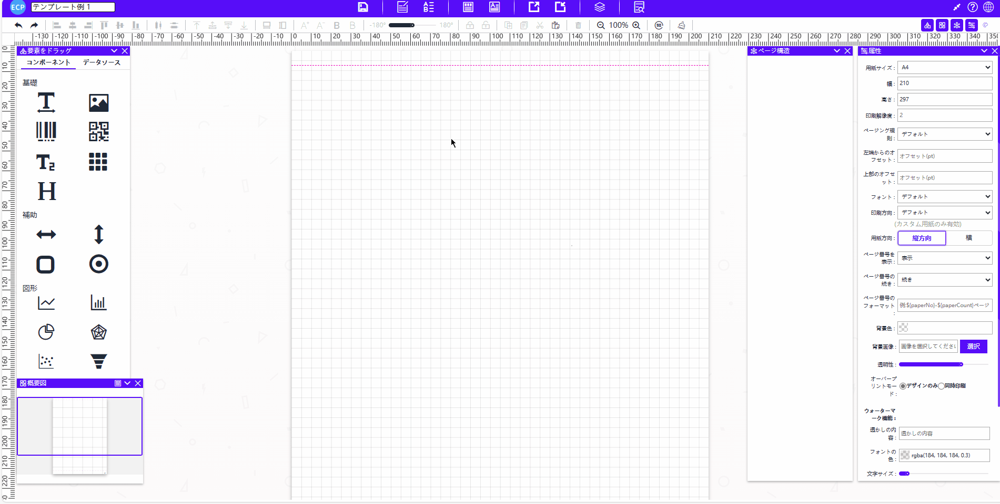
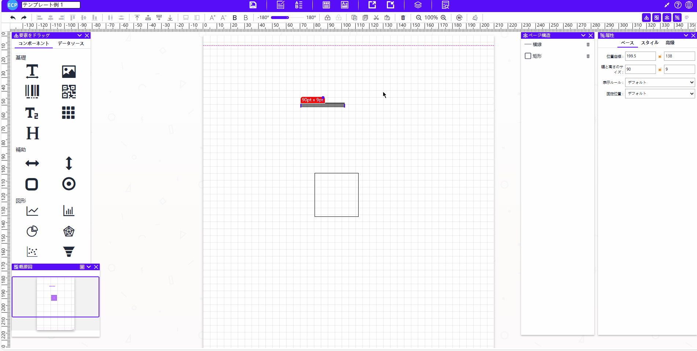
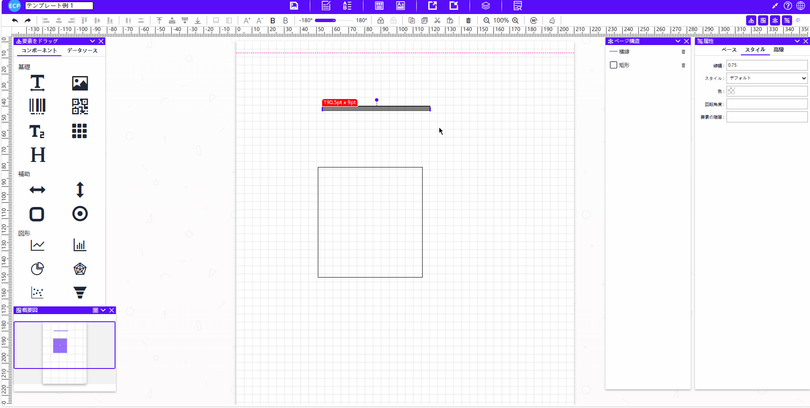

# 辅助

<aside>
💡 辅助中提供了多种类型的辅助线，如横线、竖线、矩形、椭圆。用户可以根据需要选择适合的辅助线型。
</aside>

# **拖拽与编辑**

- 将辅助中的元素拖拽至中间模板位置。
- **点击显示区域**进行旋转。
- **拖动显示区域**调整大小。

# 属性值设置

## 一、基础属性

- **位置坐标、宽度大小：** 调整元素的坐标位置和宽度大小。
- **显示规则：** 设置元素的显示规则。
- **位置固定：** 设定元素是否固定在某个位置。

## 二、样式属性

- **线宽、样式、颜色：** 调整元素的线的宽度、线的样式和显得颜色。
- **背景颜色(矩形和椭圆)：** 设置元素的背景颜色。
- **旋转角度、元素层级：**设置元素行高、旋转角度以及元素的图层叠放顺序。

## 三、高级属性

- **强制分页：** 控制元素是否强制在页面中单独显示。
- **拖动方向：** 设定元素可拖动的方向。