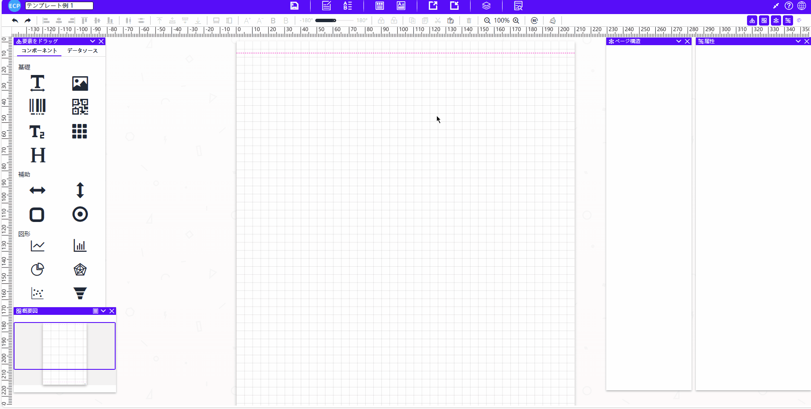
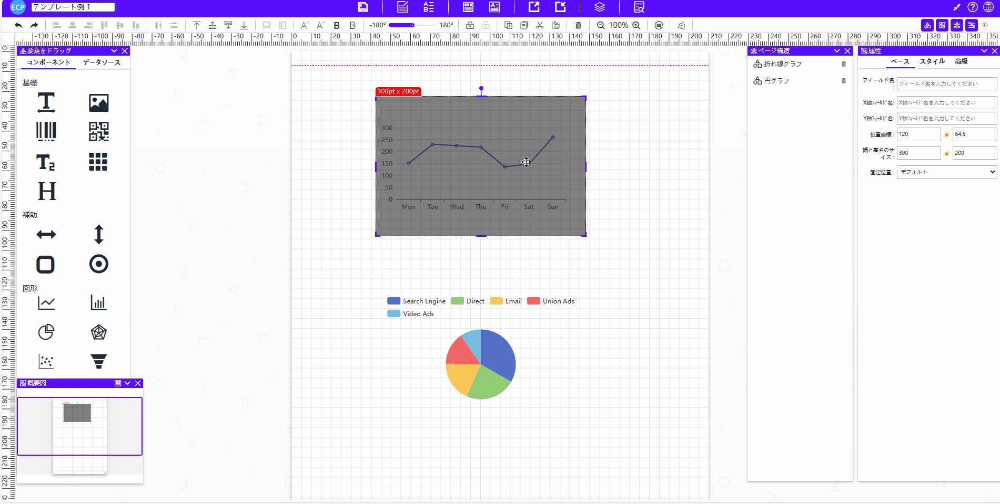
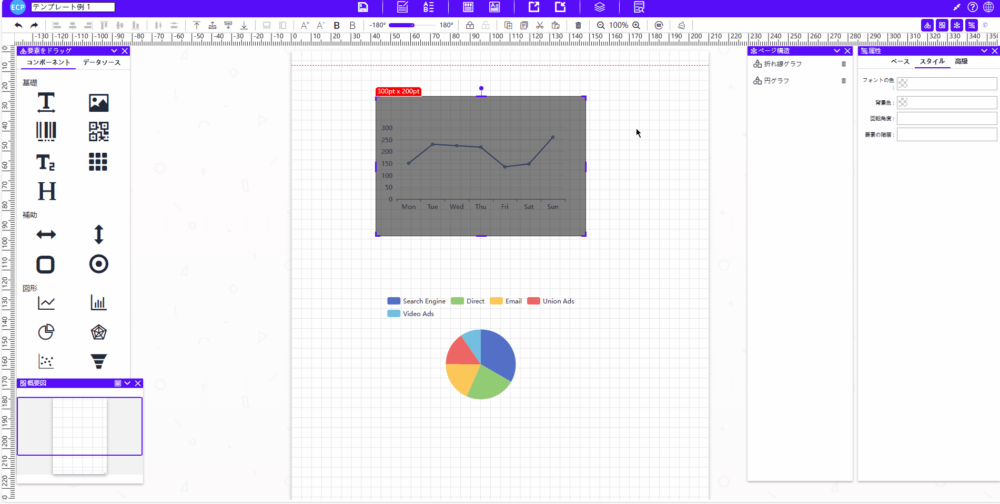

# 图表

<aside>
💡 图表中提供了多种类型的图表，如折线图、柱状图、饼图等。用户可以根据需要选择适合的图表类型，用于展示数据和信息。
</aside>

# **拖拽与编辑**

- 将图表中的元素拖拽至中间模板位置。
- **点击显示区域**进行旋转。
- **拖动显示区域**调整大小。

# 属性值设置

## 一、基础属性

- **字段名**：元素的字段名称。
- **X轴字段名(折线图、柱状图、雷达图、漏斗图)：** 元素的X轴数据字段名称。
- **Y轴字段名(折线图、柱状图、雷达图、漏斗图)：** 元素的Y轴数据字段名称。
- **数据字段名(饼图和散点图)：** 元素的数据字段名称。
- **位置坐标、宽度大小：** 调整元素的坐标位置和宽度大小。
- **位置固定：** 设定元素是否固定在某个位置。

## 二、样式属性

- **字体颜色、背景颜色：** 调整元素的排列间距以及字体和背景颜色。
- **旋转角度、元素层级：**设置元素行高、旋转角度以及元素的图层叠放顺序。

## 三、高级属性

- **强制分页：** 控制元素是否强制在页面中单独显示。
- **显示规则：**设置元素的显示规则。
- **隐藏规则：**指定元素在某些情况下的隐藏位置，比如首页或者尾页隐藏。
- **拖动方向：** 设定元素可拖动的方向。
- **格式化函数：** 提供高级属性，自定义格式化函数和样式函数。