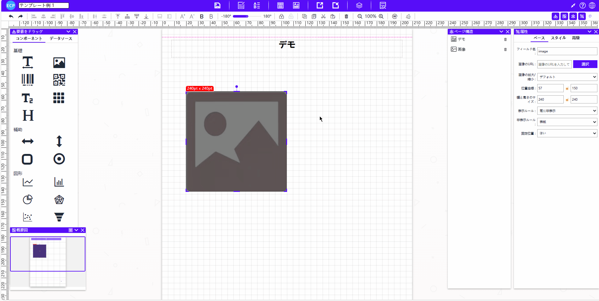
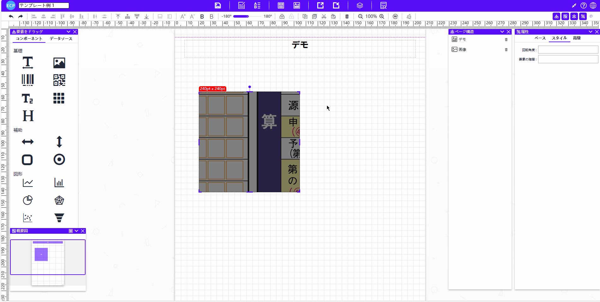

# 图片

<aside>
💡 默认没有图片地址，需要手动设置图片地址后才能正常显示图片
</aside>

# **拖拽与编辑**

- 将拖拽元素【图片】拖至中间模板位置。
- **点击图片**进行旋转。
- **拖动显示区域**调整大小。

# 属性值设置

## 一、基础属性

- **字段名：** 指定图片的字段名称。
- **图片地址：** 提供图片链接或上传小于512KB的图片。
- **图片缩放：** 控制图片的缩放比例。
- **位置坐标、宽度大小：** 调整图片的位置和尺寸。
- **显示规则：** 设置图片的显示规则。
- **隐藏规则：** 指定图片在某些情况下的隐藏位置，比如首页或者尾页隐藏。
- **位置固定：** 设定图片是否固定在某个位置。

## 二、样式属性

- **旋转角度：** 旋转图片的角度。
- **元素层级：** 控制图片在图层中的显示顺序。

## 三、高级属性

- **强制分页：** 控制图片是否强制在页面中单独显示。
- **拖动方向：** 设定图片可拖动的方向。
- **格式化函数：** 应用特殊格式化函数到图片。
- **样式函数：** 进行高级的图像处理，如变形、滤镜等。