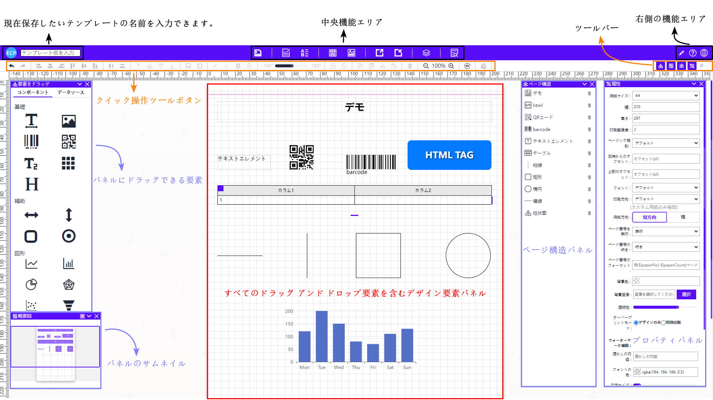
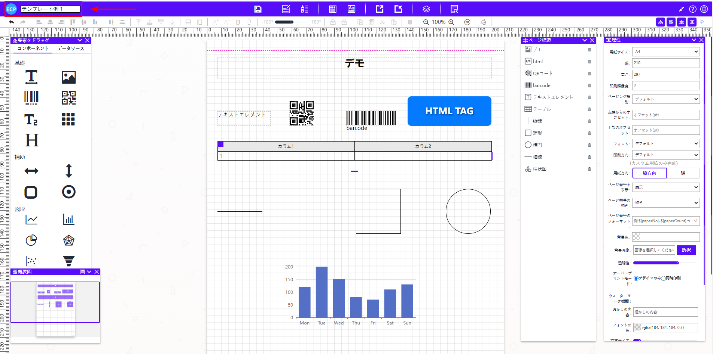
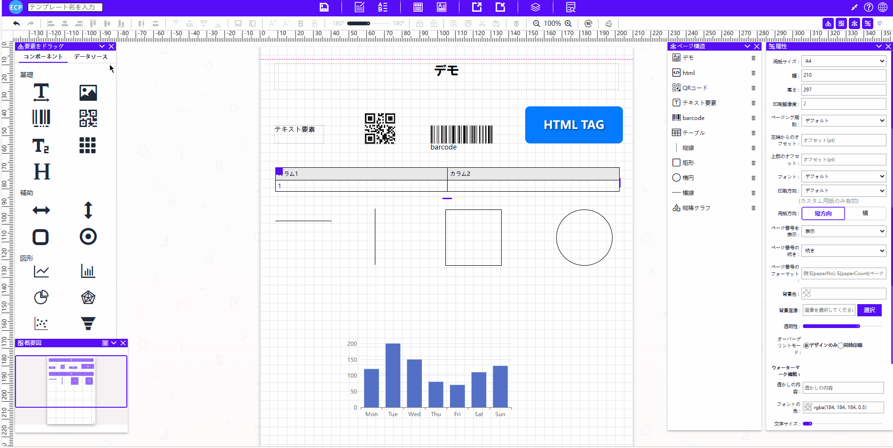
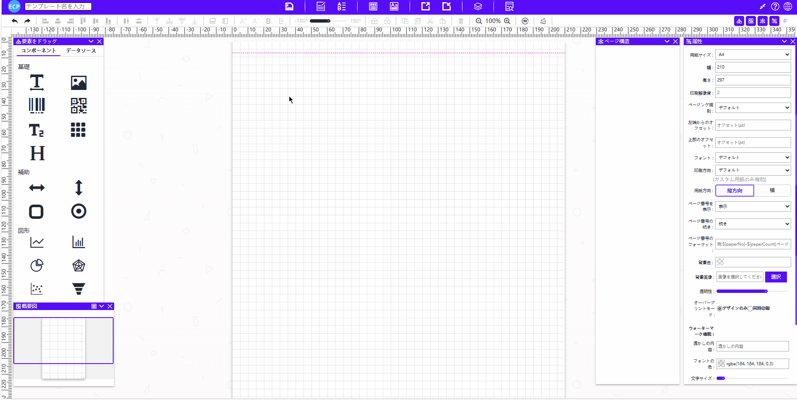
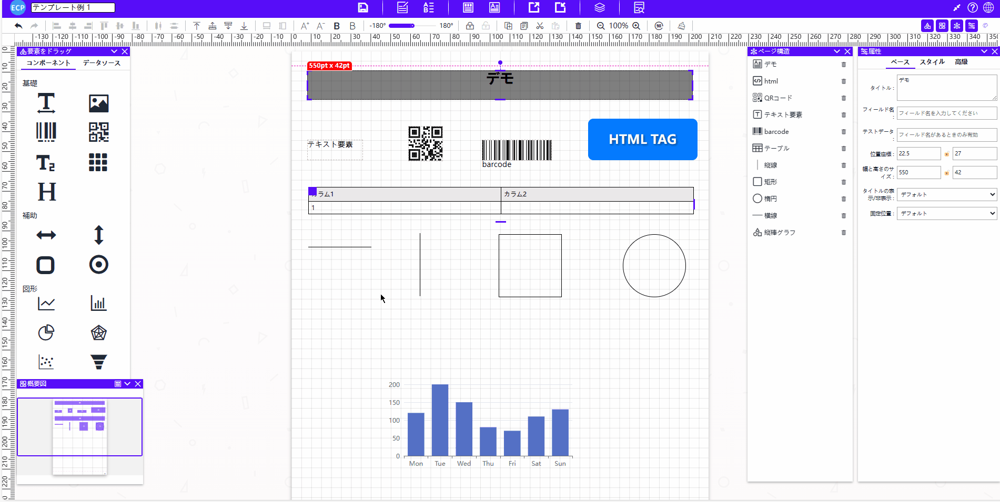

# 设计器概览

- ECP 报表软件设计器界面概览。如下图所示：

# **可输入模板名称**

- 可输入当前想保存的模板名称。如下图所示：

# **快捷操作工具按钮**

- 设计时常用功能的按钮会放在快捷按钮面板。包括：撤销、重做、左对齐、水平居中、右对齐、顶部对齐、垂直居中、底部对齐、水平分散、垂直分散、移至顶层、上移一层、下移一层、移至底层、等宽、等高、字体加大、字体减小、字体加粗、字体减粗、调整组件方向、锁定移动、解锁移动、克隆、复制、剪切、粘贴、删除、缩小、放大、旋转、清空。**个别功能只有当选择多个元素时才可使用**。如下图所示：

# **拖拽元素区域**

- 组件区域是普通拖拽元素区域，用于拖拽至面板设计，包含以下元素：文本、图片、条形码、二维码、长文本、表格、html、横线、竖线、矩形、椭圆、折线图、柱状图、饼图、雷达图、散点图、漏斗图。如下图所示：

# **数据源拖拽元素区域**

- 数据源区域是用于拖拽通过Salesforce设计完成的Object区域，包含主Object的字段和所有的子Object，也可直接拖拽至面板后设计。如下图所示：

# **概览图**

- 概览图提供两种预览模式(原始模式和概况模式)，可查看当前面板的完整缩略图。如下图所示：

# **中部功能区域**

- 中部功能区域提供如下功能：保存当前模板数据、编辑模板数据、编辑打印数据、查看json数据模型、查看Apex Class数据模型、导出到本地文件、从本地文件导入、模板中心、预览。如下图所示：

# **面板区域**

- [面板区域](./c-panel.md)包含所有拖拽的元素。点击模板空白区域可在属性中设置：纸张大小、分页规则、字体、打印方向、纸张方向、背景颜色、背景图片、添加水印等功能。如下图所示：

# **页面结构面板**

- 页面结构面板包含所有模板元素的名称。可一览模板元素列表，点击删除按钮可删除模板中的元素。如下图所示：

# **右侧功能区域**

- 右侧功能区域提供如下功能：全屏、取消全屏(开启全屏后展示)、帮助中心、切换语言。如下图所示：

# **工具栏**

- 工具栏功能允许用户可以通过点击工具栏中的图标快速显示或关闭特定的工具组件。如下图所示：

- 切换主题。如下图所示：

# **属性面板**

- 属性面板功能允许用户设置面板中元素的详细属性，如位置、大小、颜色、字体、数据类型，数据格式等，以满足设计需求和个性化要求。如下图所示：

# **快捷操作**

- 页面中使用快捷键：Ctrl/Command + S 进行保存，Ctrl/Command + Z 进行撤销，Ctrl/Command + Shift + Z 还原撤销的处理，Delete 键删除元素，键盘上下左右键微调元素位置等功能。