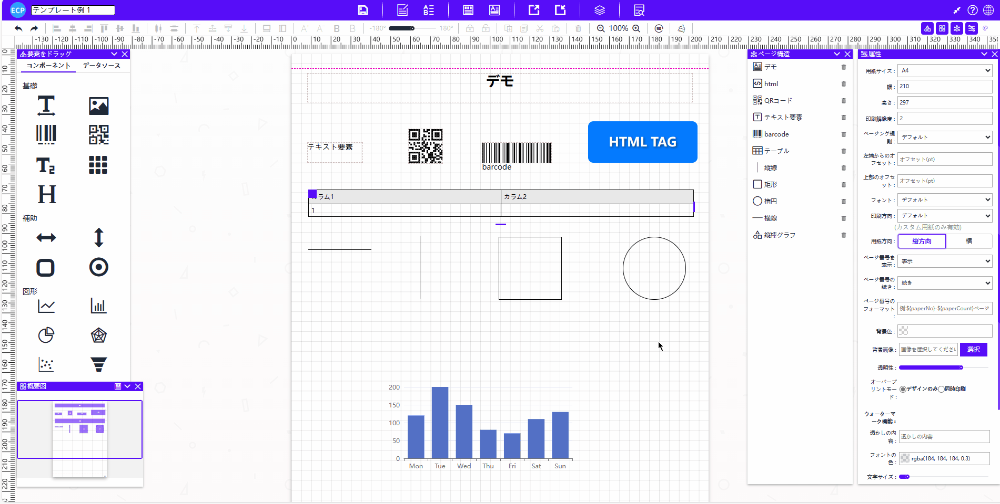

# 面板

<aside>
💡 所有打印元素实际存储的位置都在面板中。可以理解成 `“模板”` 是画框，`“面板”` 才是真正的画布。
</aside>

# **面板区域**

- 面板区域功能提供了所有拖拽元素，并允许用户设置面板属性，如纸张设定、打印设定、设置字体、设置背景颜色、添加背景图片实现套打功能、添加水印功能等。如下图所示：

# **背景图片**

- 背景图片功能允许用户上传小于512KB的图片作为背景图或套打功能的背景图。同时，用户还可以通过提供图片的URL来使用超过512KB的图片。如下图所示：

# **套打功能**

- 套打功能允许用户上传小于512KB的图片作为背景图或套打功能的背景图，并支持使用超过512KB的图片URL。用户在预览和打印时需在面板属性中选择同时打印功能，才能看到设置的背景图。如下图所示：

# **鼠标右键菜单**

- 鼠标右键菜单功能允许用户在选择单个或多个元素后，在选择的元素上右击鼠标即可弹出菜单，包含复制、粘贴、调整显示层级和对齐方式等选项，方便快速的处理和调整元素。如下图所示：

# **页眉线和页脚线**

- 页眉线和页脚线功能允许在页眉和页脚内的元素每页都会显示，但如果表格元素在页眉和页脚内显示，则会导致表格的分页功能失效。如下图所示：

