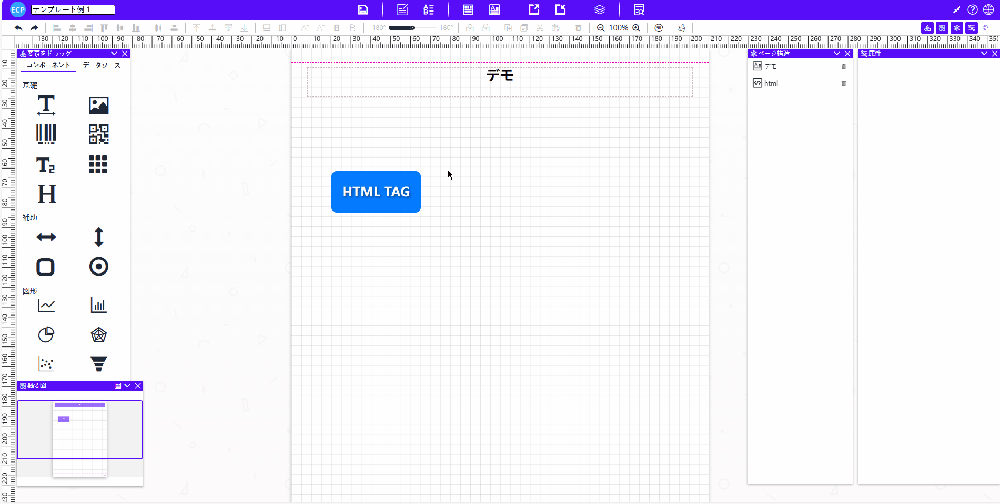
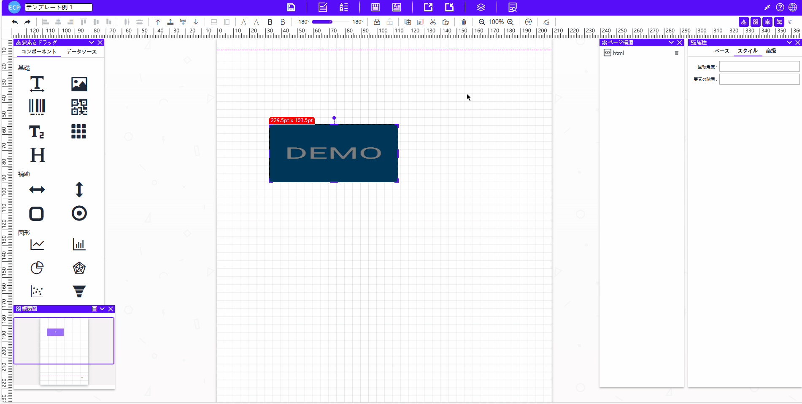

# HTML

<aside>
💡 HTML元素允许用户通过HTML代码实现表格、文本、图片等自定义元素显示。用户可以利用HTML的灵活性，创建各种个性化的设计效果。
</aside>

# **拖拽与编辑**

- 将拖拽元素【html】拖至中间模板位置。
- **点击html**进行旋转。
- **拖动显示区域**调整大小。

# 属性值设置

## 一、基础属性

- **字段名：** 指定HTML的字段名称。
- **位置坐标、宽度大小：** 调整元素的位置和尺寸。
- **显示规则：** 设置元素的显示规则。
- **隐藏规则：** 指定元素在某些情况下的隐藏位置，比如首页或者尾页隐藏。
- **位置固定：** 设定元素是否固定在某个位置。

## 二、样式属性

- **旋转角度：** 旋转元素的角度。
- **元素层级：** 控制元素在图层中的显示顺序。

## 三、高级属性

- **强制分页：** 控制元素是否强制在页面中单独显示。
- **拖动方向：** 设定元素可拖动的方向。
- **格式化函数：** 定义对拖拽元素进行格式化的函数，编写适当的格式化函数并将其应用于拖拽元素。

## 四、注意事项

- **HTML元素目前不支持分页展示，只能在单页上展示。当HTML元素的内容过长导致覆盖其他元素时，可以将元素的样式属性中的固定高度设置为固定。这样，超出部分的内容会被隐藏，不会覆盖其他元素。**

