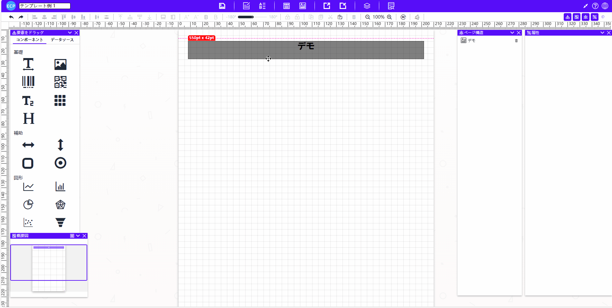
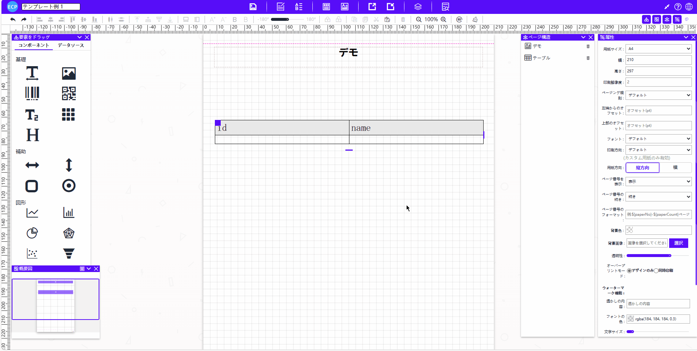
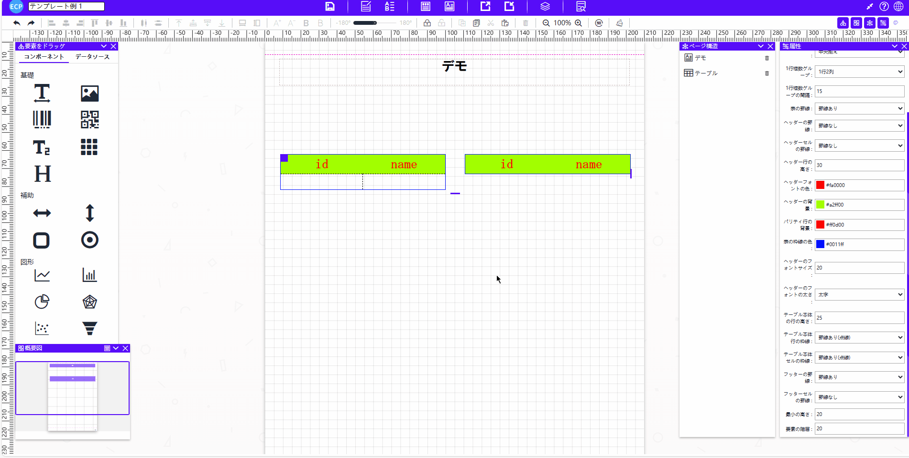
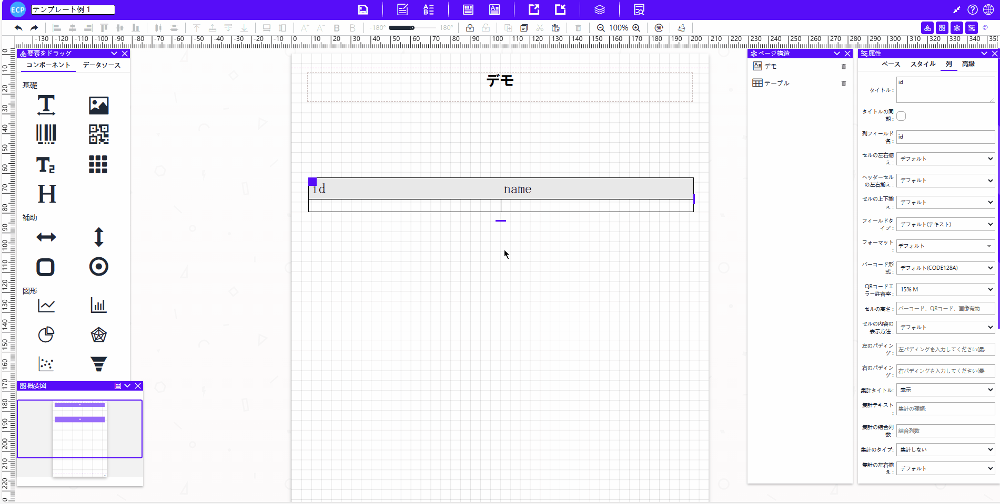

# 表格

<aside>
💡 表格用于展示和组织数据。它由行和列组成，每个单元格可以包含文本、数字、二维码、条形码、图片等类型的数据。通过表格元素，可以轻松创建、编辑和调整表格，以便更好地呈现信息。
</aside>

# **拖拽与编辑**

- 将拖拽元素【文本】拖至中间模板位置。
- 双击表格的header部分可设置标题。

# 属性值设置

## 一、基础属性

- **字段名：** 指定表格的字段名称。
- **测试数据：** 输入测试数据以预览表格效果(仅字段名存在时生效)。
- **位置坐标、宽高大小：** 调整表格的位置和尺寸。
- **表格头显示、表格脚显示：** 控制是否显示表格头和表格脚。
- **自动补全：** 启用自动补全功能。
- **每页最大行数：** 设置每页显示的最大行数。

## 二、样式属性

- **字体、字体大小、字体行高：** 设置表格文本的字体属性。

- **左右对齐：** 调整表格文本的水平对齐方式。
- **一行多组、一行多组间隔：** 支持一行显示多组数据及其间隔。

- **表格边框、表头边框、表头单元格边框、表头行高、表头字体颜色、表头背景、奇偶行背景、表格边框颜色、表头字体大小、表头字体粗细、表体行高、表体行边框、表体单元格边框、表尾边框、表尾单元格边框、最低高度、元素层级：** 定义表格的样式。

## 三、列属性

- **标题、标题同步、列字段名：** 针对每列进行标题和字段名的设置。
- **单元格左右对齐、表格头单元格左右对齐、单元格上下对齐：** 控制文本在单元格中的对齐方式。

- **字段类型、格式：** 指定数据类型，如文本、数值、日期、序号、二维码、条形码、图片等。

- **条形码格式、二维码容错率：** 针对特定列的条形码和二维码设置。
- **单元格高度、单元格内容显示方式、左内边距、右内边距：** 调整单元格的高度和内边距。
- **底部聚合标题、底部聚合文本、底部聚合合并列数、底部聚合类型、底部聚合类型左右对齐、底部聚合小数、底部聚合格式化函数、单元格渲染函数、单元格格式化函数、单元格样式函数、表格头样式函数：** 提供丰富的列级别属性设置。

## 四、高级属性

- **拖动方向：** 指定表格的拖动方向。
- **样式函数、行样式函数、表格脚函数、行/列合并函数、跨页合并是否清除、分组字段函数、分组头格式化函数、分组脚格式化函数、多组表格脚函数：** 提供高级属性，支持更复杂的表格定制需求。