# 数字证书的导入步骤

### 1. 启动程序[EC Print Agent]
- 点击[EC Print Agent]启动

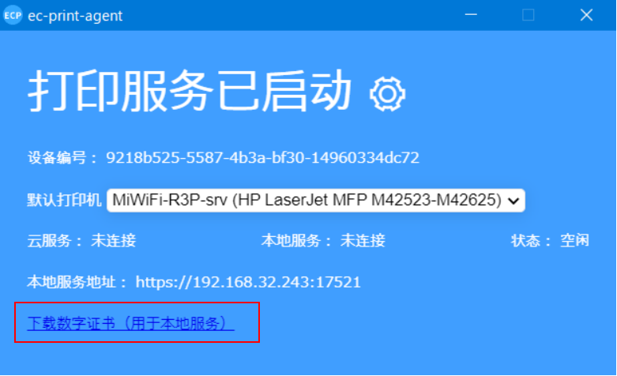

### 2. 下载数字证书
- 点击画面上的内容[下载数字证书（用于本地服务）]，保存到本地。

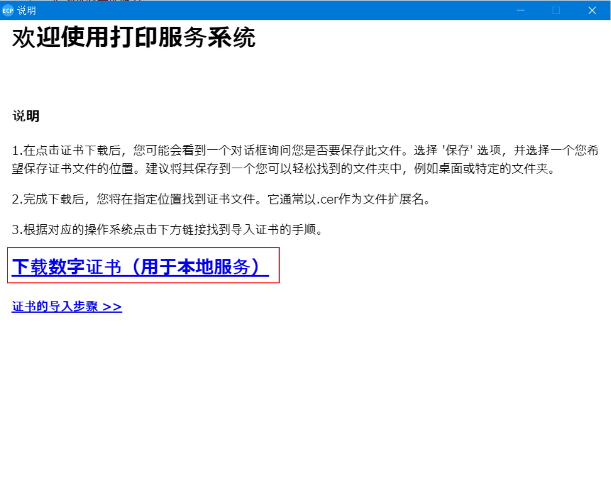
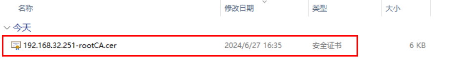

### 3. 本地安装证书
- 选择证书右键，选择[安装证书]

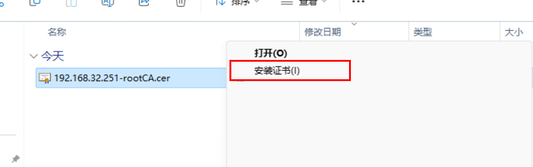

- 存储位置选择[当前用户]，点击[下一步]

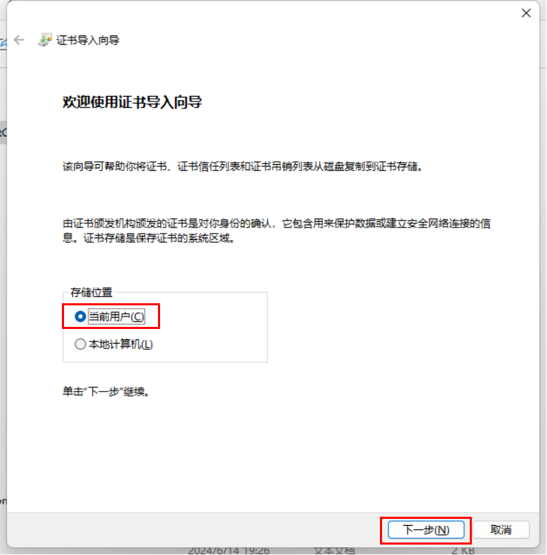

- 选择[讲所有的证书都放入下列存储]，点击[浏览]，选择[受信任的根证书颁发机构]，点击[点击确定]，再点击[下一步]

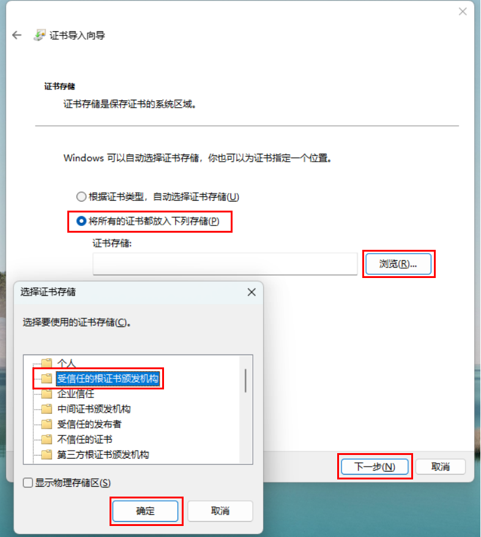

- 你已指定下列设置:[用户选定的证书存储]，点击[完成]

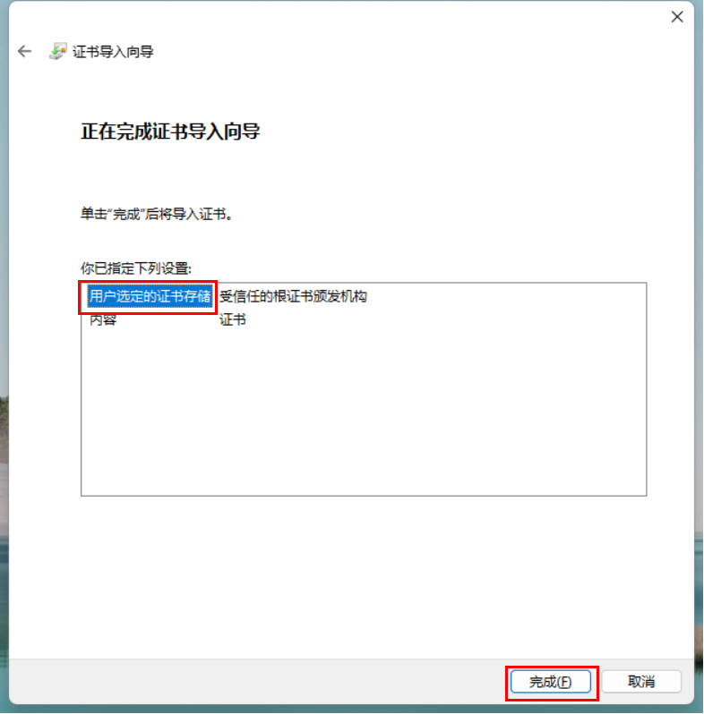

- 安全警告，点击[是]

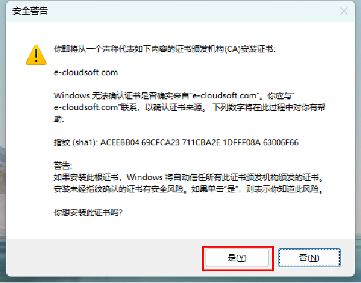

- 证书导入向导，点击[确定]

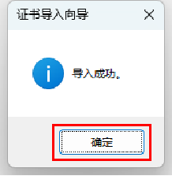

### 4. 确认打印服务
- 复制本地服务地址(双击)

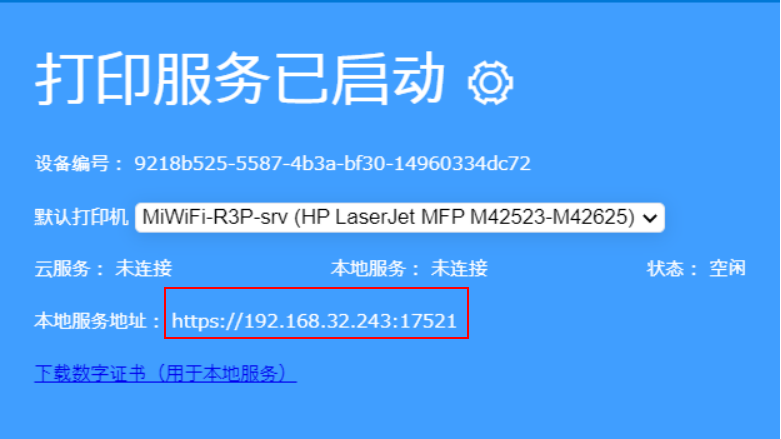

- 打开浏览器，打开复制的地址(确认地址无报错)

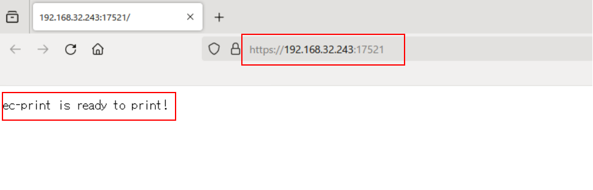

