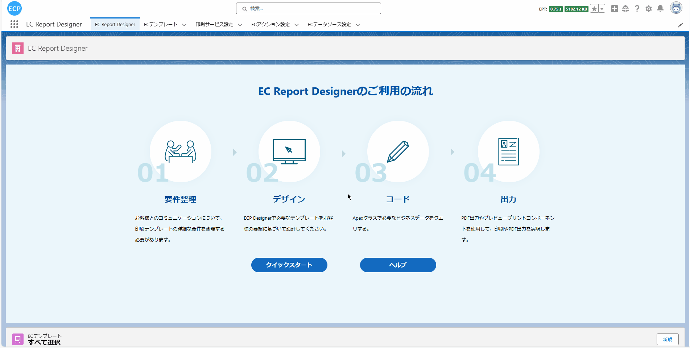
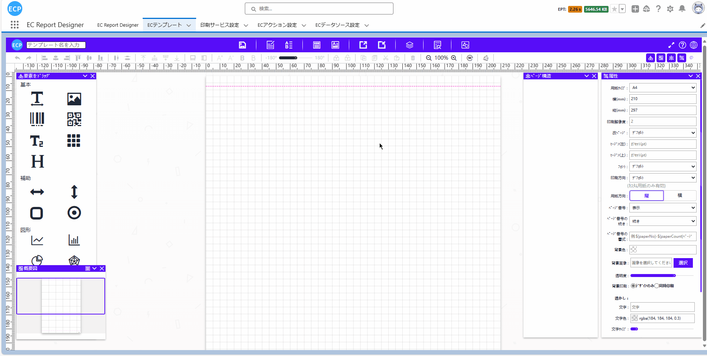
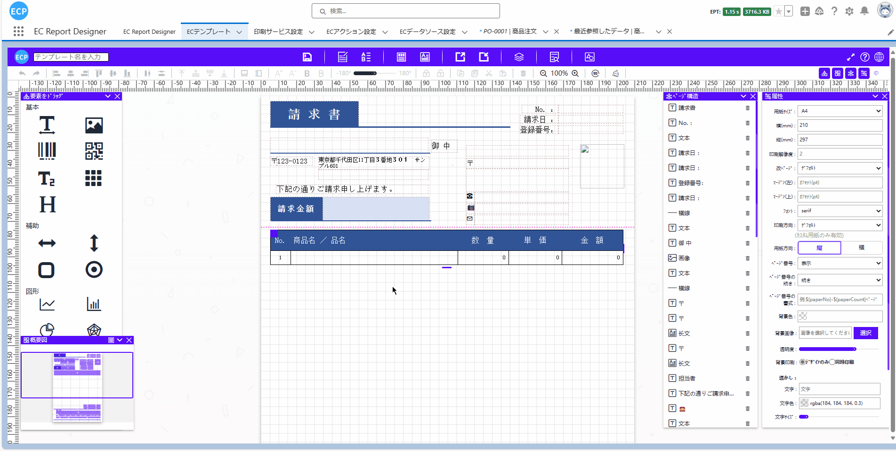
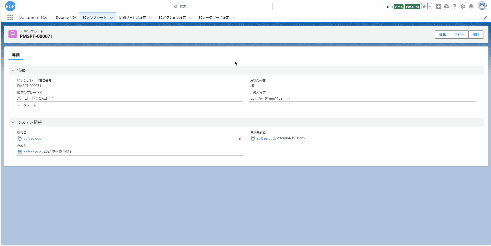
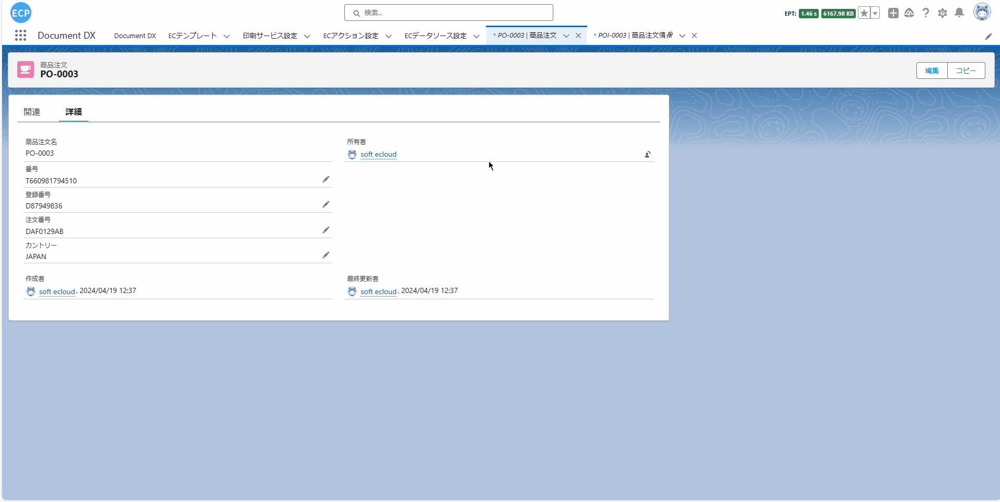
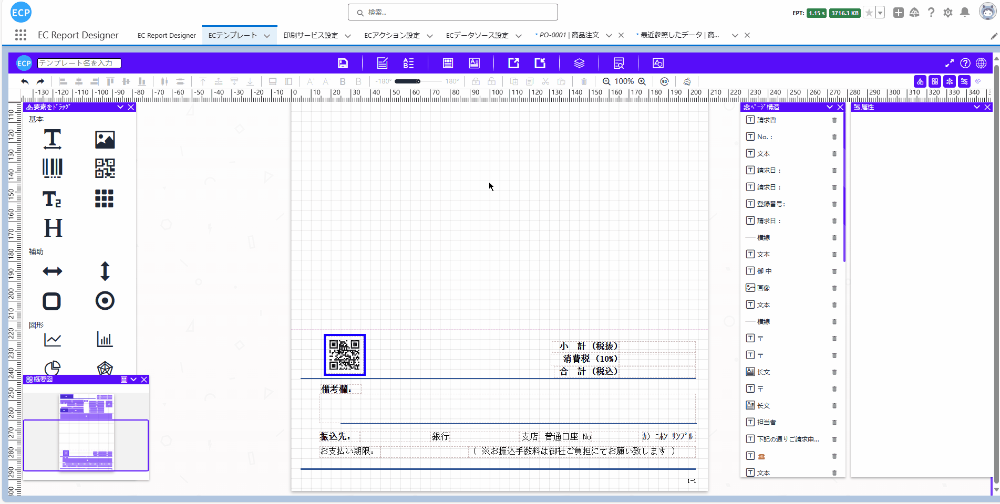

# 条码/二维码标签

<aside>
💡 在仓库管理和零售业务中，条形码和二维码标签扮演着重要的角色。通过为每个产品分配唯一的标识码，并将相关信息编码入条形码或二维码，我们可以实现对产品的精确跟踪，以及高效的库存管理和交易处理。
</aside>
<br>

# **前提条件：**

- Salesforce AppExchange 中查找我们的应用并安装到环境中。如下图所示：


# **1. 打开设计器**

- 1.1 通过Home Tab的快速开始或新建模板数据的方式打开设计器。如下图所示：



# **2. 准备报表**

- 2.1 在开始设计过程时，有多种方式可以帮助您创建设计的基础。您可以选择扫描一个现有的报表，从网络上下载一个报表，直接从设计工具的模板中心选取一个模板或者新建一个模板。例如，你可以从模板中心选取 BAR-QR 示例（水平）模板，如下图所示：



# **页眉线和页脚线**

- 页眉线和页脚线功能可查看[请求书](sc-request.md)中的**页眉线和页脚线**。

# **3. 模板的属性设置**

- 3.1 模板的属性设置可查看[请求书](sc-request.md)中的**第3步**。

# **4. 元素的宽高大小设置**

- 4.1 元素的宽高大小设置可查看[请求书](sc-request.md)中的**第4步**。

# **5. 编辑模板**

- 5.1 将模板调整至满足预期的效果。需要注意的是：由于需要修改的元素过多，本示例仅展示了如何修改'Delivery No.'字段，实际操作中，可能需要将所有元素的字段名或样式等调整到预期效果。如下图所示：



# **6. 编辑打印数据、查看JSON数据模型、导出、从本地文件导入和预览功能**

- 6.1 编辑打印数据、查看JSON数据模型等功能可查看[请求书](sc-request.md)中的**第10步**。

# **7. 保存模板和查看模板信息**

- 7.1 保存模板和查看模板信息处理可查看[请求书](sc-request.md)中的**第11步**。

# **8. 抽取业务数据**

- 8.1 通过点击查看Apex Class数据模型按钮或通过快捷键(Ctrl / Command + M)打开查看Apex Class数据模型画面，将代码全部复制后点击取消全屏按钮，并打开已保存的模板数据查看模板的信息，复制的代码用于**8.3步骤**创建自定义打印数据返回的对象。如下图所示：


- 8.2 抽取业务数据处理可查看[请求书](sc-request.md)中的**第12步**。

- 8.3 通过**8.1步骤**复制的代码创建一个新的ApexClass文件，用于自定义开发抽取数据后返回的对象。如下图所示：



- 8.4 编辑通过**8.2步骤**新建的Apex Class文件，通过自定义开发，编写SQL抽取业务数据。如下图所示：



- 8.4.1 完整Apex Class代码。如下所示：

```
public with sharing class Demo_Ctrl01 {
    public Demo_Ctrl01 (ApexPages.StandardController controller) {}
    public List<String> templateNames {get; set;}
    public String dataSource { get; set; }
    public String printSeviceName { get; set; }
    public String machineId { get; set; }
    public String printMode { get; set; }
    public List<String> itemIds { get; set; }
    public List<SObject> selectedObjects { get; set; }

    public void initAction() {
        templateNames = new List<String>{'バーコードとQRコード'};
        // カスタム開発ではこのフィールドを設定できます
        dataSource = objectDataToJsonStr();
        printSeviceName = 'Print Cloud Service Config';
        machineId = 'fdcd6b04-9b6e-48b1-8e57-0ee5caf88063';
    }

    private String objectDataToJsonStr () {
        List<eprint__product_order__c> productOrders = [
            SELECT 
                Name, eprint__orderNo__c, eprint__country__c, eprint__registrationNumber__c, eprint__no__c,
                (SELECT eprint__barCode__c, eprint__qrCode__c, eprint__productName__c, eprint__quantity__c,
                    eprint__address__c, eprint__tel__c, eprint__batchNumber__c, eprint__lineNo__c
                FROM eprint_product_order_info__r)
            FROM eprint__product_order__c
            WHERE Name = 'PO-0003'
        ];
        List<TemplateProject> templateProjects = new List<TemplateProject>();
        for (eprint__product_order__c productOrder : productOrders) {
            for (eprint__product_order_info__c productOrderInfo : productOrder.eprint_product_order_info__r) {
                TemplateProject templateProject = new TemplateProject();
                // barcode
                templateProject.barcode = productOrderInfo.eprint__barCode__c;
                // qrcode
                templateProject.qrcode = productOrderInfo.eprint__qrCode__c;
                // 23K
                templateProject.lineNo = productOrderInfo.eprint__lineNo__c;
                // 商品名の値
                templateProject.productName = productOrderInfo.eprint__productName__c;
                // 配送数量の値
                templateProject.quantity = String.valueOf(productOrderInfo.eprint__quantity__c);
                // 商品注文名の値
                templateProject.Name = productOrder.Name;
                // 注文番号の値
                templateProject.orderNo = productOrder.eprint__orderNo__c;
                // 配送住所の値
                templateProject.address = productOrderInfo.eprint__address__c;
                // カントリーの値
                templateProject.country = productOrder.eprint__country__c;
                // 登録番号の値
                templateProject.registrationNumber = productOrder.eprint__registrationNumber__c;
                // 連絡電話の値
                templateProject.tel = productOrderInfo.eprint__tel__c;
                // 番号の値
                templateProject.no = productOrder.eprint__no__c;
                // 出荷番号の値
                templateProject.batchNumber = productOrderInfo.eprint__batchNumber__c;
                templateProjects.add(templateProject);
            }
        }
        return JSON.serialize(templateProjects);
    }
}
```

# **9. 打印预览和导出PDF**

- 9.1 打印预览和导出PDF处理可查看[请求书](sc-request.md)中的**第13步**。

- 9.2 预览模板最终结果。如下图所示：

