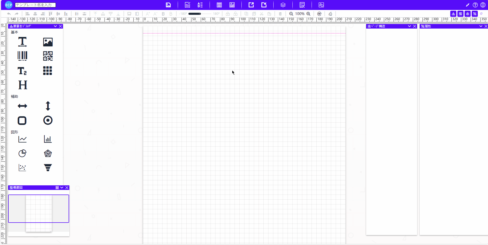
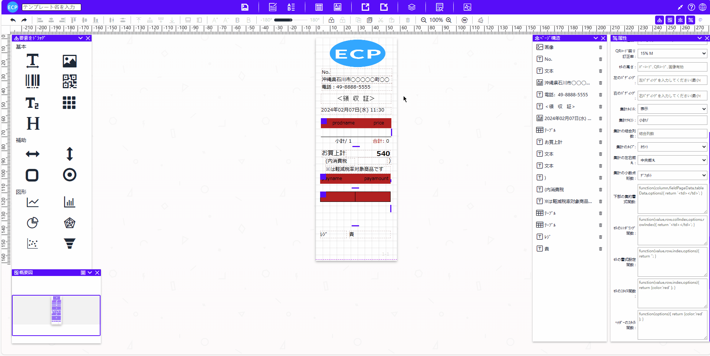

# 条码/二维码标签

<aside>
💡 条形码和二维码在报表设计中被广泛使用。当在设计报表过程中需要添加或修改条形码或二维码时，您可以参考本章的说明进行操作。在报表设计器中，添加条形码或二维码通常包括选择数据源与字段、确定条码类型、调整布局格式等步骤，并可利用预览功能进行查看和调试。
</aside>
 

# **前提条件：**

- Salesforce AppExchange 中查找我们的应用并安装到环境中。如下图所示：

# **1. 打开设计器**

1.1 通过Home Tab的快速开始或新建模板数据的方式打开设计器。如下图所示：

# **2. 准备报表**

- 2.1 在开始设计过程时，有多种方式可以帮助您创建设计的基础。您可以选择扫描一个现有的报表，从网络上下载一个报表，直接从设计工具的模板中心选取一个模板或者新建一个模板。例如，你可以从模板中心选取一个模板，如下图所示：

# **页眉线和页脚线**

- 页眉线和页脚线功能可查看[请求书](sc-request.md)中的**页眉线和页脚线**。

# **3. 模板的属性设置**

- 3.1 模板的属性设置可查看[请求书](sc-request.md)中的**第3步**。

# **4. 元素的宽高大小设置**

- 4.1 元素的宽高大小设置可查看[请求书](sc-request.md)中的**第4步**。

# **5. 添加二维码并设置二维码的属性**

#### **添加二维码**

- 5.1 在设计器中，您可以拖拽一个二维码元素到面板中。如下图所示：

#### **基础**

- 5.2 设置了字段名后您就可以在提取业务数据时将其与数据字段进行绑定。这样，当您预览时，抽取出的数据可以通过其绑定关系找到并显示相应的元素。此外，设置好字段名后，您还可以在测试数据中输入您的业务数据，以此来验证元素设置的正确性。如下图所示：

- 5.3 标题显示隐藏：对于二维码元素，其标题不会显示。

#### **样式**

- 5.4 您可以通过调整'旋转角度'来改变元素的方向。系统支持从-180度到180度的调整范围。如下图所示：

- 5.5 元素层级设置用于决定元素在重叠时的显示优先级，设置值越大的元素其层级越高，相应地也将显示在更上层。

#### **边框**

- 5.6 边框设置：您可以为当前元素添加上、下、左、右四个方向的边框，并可以设定边框的粗细和颜色。同时，您也可以调整元素内部数据跟边框之间在上、下、左、右四个方向的边距。如下图所示：

#### **高级**

- 5.7 打印类型会根据当前元素的类型自动选择。当前元素是二维码，那么打印类型就会默认选择二维码。您也可以手动设置为其他类型，如：文本或条形码。

- 5.8 二维码容错率：这是指二维码在被扫描时能够容忍的错误和损坏的程度。通常以百分比表示，代表二维码中允许存在的错误比例。容错率越高，二维码能够承受的错误就越多。然而，需要注意的是，容错率越高，二维码的密度就会越低，因为一部分空间需要用于错误修复。因此，如果希望提高容错率，可能需要相应地增加二维码的尺寸，以容纳更多的错误修正信息。

# **6. 添加条形码并设置条形码的属性**

#### **添加条形码**

- 6.1 在设计器中，您可以拖拽一个条形码元素到面板中。如下图所示：

#### **基础**

- 6.2 设置了字段名后您就可以在提取业务数据时将其与数据字段进行绑定。这样，当您预览时，抽取出的数据可以通过其绑定关系找到并显示相应的元素。此外，设置好字段名后，您还可以在测试数据中输入您的业务数据，以此来验证元素设置的正确性。如下图所示：

- 6.3 标题显示隐藏：对于条形码元素，其标题则会默认显示。如果您不希望显示条形码元素的标题，可以选择将其隐藏。如下图所示：

#### **样式**

- 6.4 您可以通过调整'旋转角度'来改变元素的方向。系统支持从-180度到180度的调整范围。如下图所示：

- 6.5 元素层级设置用于决定元素在重叠时的显示优先级，设置值越大的元素其层级越高，相应地也将显示在更上层。

#### **边框**

- 6.6 边框设置：您可以为当前元素添加上、下、左、右四个方向的边框，并可以设定边框的粗细和颜色。同时，您也可以调整元素内部数据跟边框之间在上、下、左、右四个方向的边距。如下图所示：

#### **高级**

- 6.7 打印类型会根据当前元素的类型自动选择。当前元素是条形码，那么打印类型就会默认选择条形码。您也可以手动设置为其他类型，如：文本或二维码。

- 6.8 条形码格式：您可以选择多种不同的条形码格式。如下图所示：

# **7. 编辑打印数据、查看JSON数据模型、导出、从本地文件导入和预览功能**

- 7.1 编辑打印数据、查看JSON数据模型等功能可查看[请求书](sc-request.md)中的**第10步**。

# **8. 保存模板和查看模板信息**

- 8.1 保存模板和查看模板信息处理可查看[请求书](sc-request.md)中的**第11步**。

# **9. 抽取业务数据**

- 9.1 抽取业务数据处理可查看[请求书](sc-request.md)中的**第12步**。

- 9.2 编辑新建的Apex Class文件，通过自定义开发，编写SQL抽取业务数据。如下图所示：

- 9.2.1 完整Apex Class代码。如下图所示：

# **10. 打印预览和导出PDF**

- 10.1 抽取业务数据处理可查看[请求书](sc-request.md)中的**第13步**。

- 10.2 预览模板最终结果。如下图所示：

