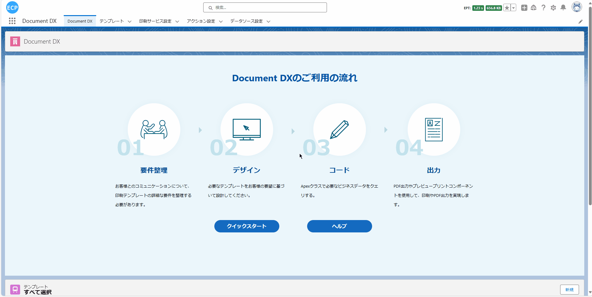

# 云打印

<aside>
💡 云打印是一项利用互联网连接打印设备并实现远程打印的技术。它适用于各种场景，其中一个主要作用是在设计器完成模板设计后，只需简单配置并连接打印机，即可将设计好的模板快速打印出来。这样的方案消除了地点限制，无论何时何地都可以便捷地实现打印需求。只需简单修改配置，连接新的打印机器码，就能在新的场所继续打印，极大地提高了打印效率和灵活性。
</aside>
<br>

# **1. 前提条件，配置打印中继应用程序：**

<span style="display:block;color:orangered;font-size:20px;">如果已经配置过打印中继应用程序，请直接跳至第二步</span>

- 1.1 下载打印中继应用程序。

请访问[打印终端](download.md)下载打印中继应用程序。

- 1.2 启动中继应用程序并设置连接参数。

```
服务器地址：
    https://print.e-cloudsoft.com:8443
服务器令牌(购买后提供)：
    4a504e303030303031313233343536
```


# **2. 打开设计器**

- 2.1 通过Home Tab的快速开始或新建模板数据的方式打开设计器。如下图所示：



# **3. 准备报表**

- 3.1 准备报表可查看[申告书](sc-declarationForm.md)中的**第二步**，或通过拖拽元素的方式新建一个模板，当前例子使用申告书中的第二步模板演示。

# **页眉线和页脚线**

- 页眉线和页脚线功能可查看[请求书](sc-request.md)中的**页眉线和页脚线**。

# **4. 模板的属性设置**

- 4.1 模板的属性设置可查看[请求书](sc-request.md)中的**第3步**。

# **5. 元素的宽高大小设置**

- 5.1 元素的宽高大小设置可查看[请求书](sc-request.md)中的**第4步**。

# **6. 文本元素的属性设置**

- 6.1 文本元素的属性设置可查看[请求书](sc-request.md)中的**第5步**。

# **7. 图片元素的属性设置**

- 7.1 图片元素的属性设置可查看[请求书](sc-request.md)中的**第6步**。

# **8. 辅助元素的属性设置**

- 8.1 辅助元素的属性设置可查看[请求书](sc-request.md)中的**第7步**。

# **9. 表格元素的属性设置**

- 9.1 表格元素的属性设置可查看[请求书](sc-request.md)中的**第8步**。

# **10. 二维码和条形码元素的属性**

- 10.1 二维码和条形码元素的属性设置可查看[请求书](sc-request.md)中的**第9步**。

# **11. 编辑打印数据、查看JSON数据模型、导出、从本地文件导入和预览功能**

- 11.1 编辑打印数据、查看JSON数据模型等功能可查看[请求书](sc-request.md)中的**第10步**。

# **12. 保存模板和查看模板信息**

- 12.1 保存模板和查看模板信息处理可查看[请求书](sc-request.md)中的**第11步**。

# **13. 抽取业务数据**

- 13.1 抽取业务数据处理可查看[申告书](sc-declarationForm.md)中的**第12步**。

# **14. 云打印配置**

- 14.1 点击'打印服务设置'Tab，可以新建云打印或编辑既存的云打印服务，如果已经配置完成中继应用程序那么在云打印配置下方会显示已连接的打印机器信息。如下图所示：


# **15. 打印预览和导出PDF**

- 15.1 打印预览和导出PDF处理可查看[申告书](sc-declarationForm.md)中的**第13步**。