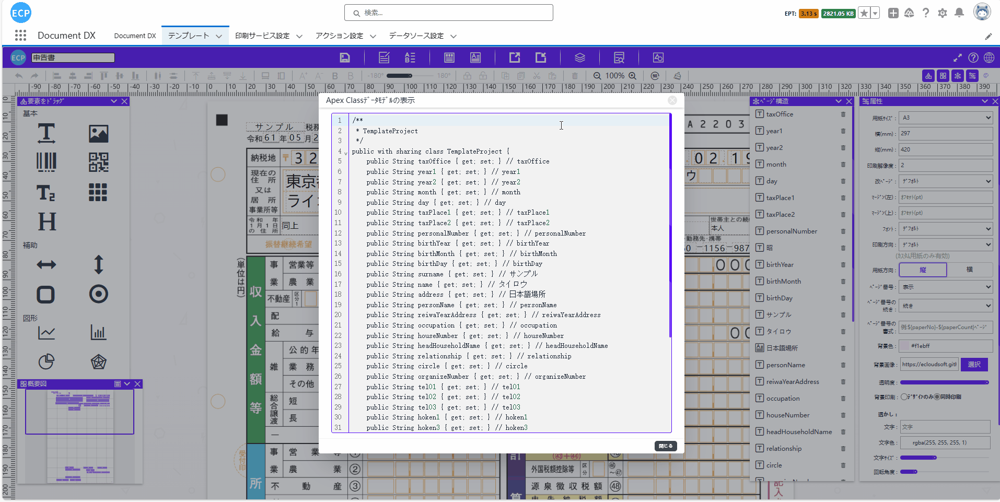
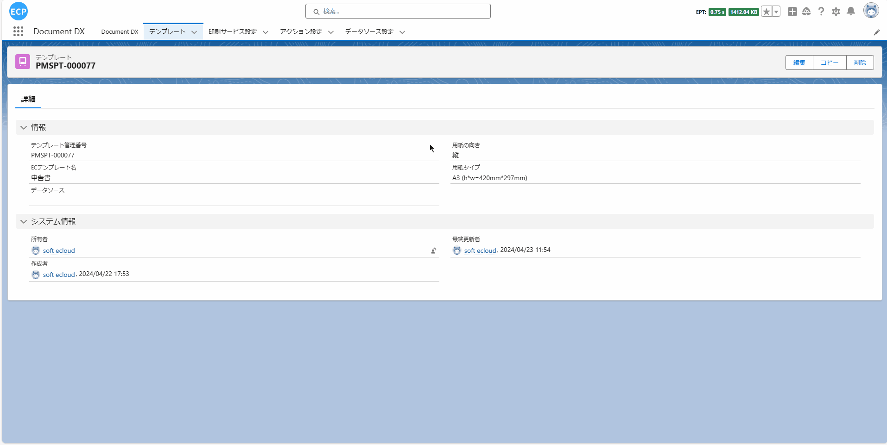
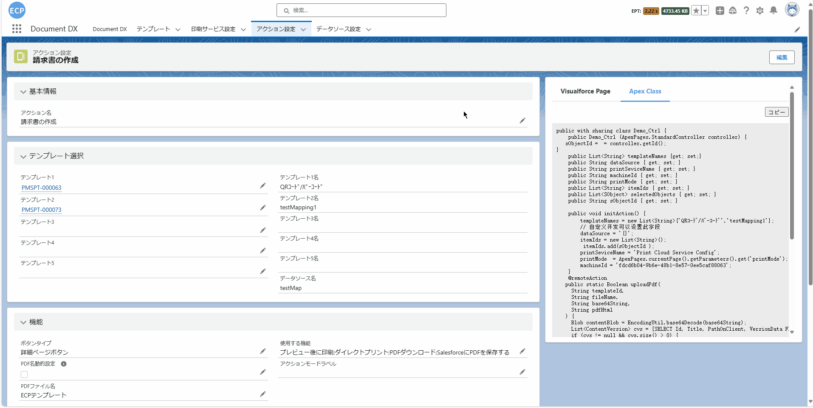

# 自定义开发

<aside>
💡 开发者可以通过自定义开发来抽取业务对象的数据，并且可以根据实际需求自行选择需要抽取的数据字段。这种灵活性使得开发者能够根据具体业务需求定制数据提取流程，确保只提取所需的数据，避免不必要的数据冗余，提高数据处理的效率和准确性。
</aside>
<br>

# **前提条件：**

- Salesforce AppExchange 中查找我们的应用并安装到环境中。如下图所示：


# **1. 打开设计器**

- 1.1 通过Home Tab的快速开始或新建模板数据的方式打开设计器。如下图所示：


# **2. 准备报表**

- 2.1 准备报表可查看[申告书](sc-declarationForm.md)中的**第二步**，或通过拖拽元素的方式新建一个模板，当前例子使用申告书中的第二步模板演示。

# **页眉线和页脚线**

- 页眉线和页脚线功能可查看[请求书](sc-request.md)中的**页眉线和页脚线**。

# **3. 模板的属性设置**

- 3.1 模板的属性设置可查看[请求书](sc-request.md)中的**第3步**。

# **4. 元素的宽高大小设置**

- 4.1 元素的宽高大小设置可查看[请求书](sc-request.md)中的**第4步**。

# **5. 文本元素的属性设置**

- 5.1 文本元素的属性设置可查看[请求书](sc-request.md)中的**第5步**。

# **6. 图片元素的属性设置**

- 6.1 图片元素的属性设置可查看[请求书](sc-request.md)中的**第6步**。

# **7. 辅助元素的属性设置**

- 7.1 辅助元素的属性设置可查看[请求书](sc-request.md)中的**第7步**。

# **8. 表格元素的属性设置**

- 8.1 表格元素的属性设置可查看[请求书](sc-request.md)中的**第8步**。

# **9. 二维码和条形码元素的属性**

- 9.1 二维码和条形码元素的属性设置可查看[请求书](sc-request.md)中的**第9步**。

# **10. 编辑打印数据、查看JSON数据模型、导出、从本地文件导入和预览功能**

- 10.1 编辑打印数据、查看JSON数据模型等功能可查看[请求书](sc-request.md)中的**第10步**。

# **11. 保存模板和查看模板信息**

- 11.1 保存模板和查看模板信息处理可查看[请求书](sc-request.md)中的**第11步**。

# **12. 通过自定义开发抽取业务数据**

- 12.1 点击设计器中“ApexClass数据模型”图标获取Apex类定义内容，用于绑定到模板作为自定义开发返回的数据对象。如下图所示：



- 12.2 将上述获取的内容通过CTRL+C/CTRL+V的方式，创建新的Apex类。完整代码如下：

```
/**
 * TemplateProject
 */
public with sharing class TemplateProject {
    public String taxOffice { get; set; } // taxOffice
    public String year1 { get; set; } // year1
    public String year2 { get; set; } // year2
    public String month { get; set; } // month
    public String day { get; set; } // day
    public String taxPlace1 { get; set; } // taxPlace1
    public String taxPlace2 { get; set; } // taxPlace2
    public String personalNumber { get; set; } // personalNumber
    public String birthYear { get; set; } // birthYear
    public String birthMonth { get; set; } // birthMonth
    public String birthDay { get; set; } // birthDay
    public String surname { get; set; } // サンプル
    public String name { get; set; } // タイロウ
    public String address { get; set; } // 日本語場所
    public String personName { get; set; } // personName
    public String reiwaYearAddress { get; set; } // reiwaYearAddress
    public String occupation { get; set; } // occupation
    public String houseNumber { get; set; } // houseNumber
    public String headHouseholdName { get; set; } // headHouseholdName
    public String relationship { get; set; } // relationship
    public String circle { get; set; } // circle
    public String organizeNumber { get; set; } // organizeNumber
    public String tel01 { get; set; } // tel01
    public String tel02 { get; set; } // tel02
    public String tel03 { get; set; } // tel03
    public String hoken1 { get; set; } // hoken1
    public String hoken3 { get; set; } // hoken3
    public String hoken2 { get; set; } // hoken2
    public String bank { get; set; } // bank
    public String branch { get; set; } // branch
    public String hoken_sum { get; set; } // hoken_sum
    public String postOfficeName { get; set; } // postOfficeName
    public String account { get; set; } // account
    public String account2 { get; set; } // account2
    public String manage { get; set; } // manage
    public String roster { get; set; } // roster
    public TemplateProject() {

    }
}
```

- 12.3 通过自定义开发抽取业务对象的数据，将自定义开发的代码创建为新的Apex类。完整代码如下：

```
public with sharing class Demo_Ctrl01 {
    public Demo_Ctrl01 (ApexPages.StandardController controller) {}
    public List<String> templateNames {get; set;}
    public String dataSource { get; set; }
    public String printSeviceName { get; set; }
    public String machineId { get; set; }
    public String printMode { get; set; }
    public List<String> itemIds { get; set; }
    public List<SObject> selectedObjects { get; set; }

    public void initAction() {
        templateNames = new List<String>{'申告書'};
        // カスタム開発ではこのフィールドを設定できます
        dataSource = objectDataToJsonStr();
        printSeviceName = 'Print Cloud Service Config';
        machineId = 'fdcd6b04-9b6e-48b1-8e57-0ee5caf88063';
    }

    private String objectDataToJsonStr () {
        List<eprint__declaration_info__c> declarationInfos = [
            SELECT 
                eprint__tax_office__c,
                eprint__year1__c,
                eprint__month__c,
                eprint__day__c,
                eprint__year2__c,
                eprint__personal_number__c,
                eprint__birth_year__c,
                eprint__birth_month__c,
                eprint__tax_place2__c,
                eprint__birth_day__c,
                eprint__tax_place1__c,
                eprint__surname__c,
                eprint__name__c,
                eprint__address__c,
                eprint__person_name__c,
                eprint__reiwa_year_address__c,
                eprint__occupation__c,
                eprint__house_number__c,
                eprint__head_household_name__c,
                eprint__relationship__c,
                eprint__circle__c,
                eprint__organize_number__c,
                eprint__tel01__c,
                eprint__tel02__c,
                eprint__tel03__c,
                eprint__hoken1__c,
                eprint__hoken3__c,
                eprint__hoken2__c,
                eprint__bank__c,
                eprint__branch__c,
                eprint__hoken_sum__c,
                eprint__post_office_name__c,
                eprint__account__c,
                eprint__account2__c,
                eprint__roster__c,
                eprint__manage__c
            FROM
                // 主表：申告の基本情報
                eprint__declaration_info__c
            WHERE 
                Name = 'DI-0001'
        ];
        List<TemplateProject> templateProjects = new List<TemplateProject>();
        for (eprint__declaration_info__c declarationInfo : declarationInfos) {
            TemplateProject templateProject = new TemplateProject();
            // taxOffice
            templateProject.taxOffice = declarationInfo.eprint__tax_office__c;
            // year1
            templateProject.year1 = declarationInfo.eprint__year1__c;
            // month
            templateProject.month = declarationInfo.eprint__month__c;
            // day
            templateProject.day = declarationInfo.eprint__day__c;
            // year2
            templateProject.year2 = declarationInfo.eprint__year2__c;
            // personalNumber
            templateProject.personalNumber = declarationInfo.eprint__personal_number__c;
            // birthYear
            templateProject.birthYear = declarationInfo.eprint__birth_year__c;
            // birthMonth
            templateProject.birthMonth = declarationInfo.eprint__birth_month__c;
            // taxPlace2
            templateProject.taxPlace2 = declarationInfo.eprint__tax_place2__c;
            // birthDay
            templateProject.birthDay = declarationInfo.eprint__birth_day__c;
            // taxPlace1
            templateProject.taxPlace1 = declarationInfo.eprint__tax_place1__c;
            // surname
            templateProject.surname = declarationInfo.eprint__surname__c;
            // name
            templateProject.name = declarationInfo.eprint__name__c;
            // address
            templateProject.address = declarationInfo.eprint__address__c;
            // personName
            templateProject.personName = declarationInfo.eprint__person_name__c;
            // reiwaYearAddress
            templateProject.reiwaYearAddress = declarationInfo.eprint__reiwa_year_address__c;
            // occupation
            templateProject.occupation = declarationInfo.eprint__occupation__c;
            // houseNumber
            templateProject.houseNumber = declarationInfo.eprint__house_number__c;
            // headHouseholdName
            templateProject.headHouseholdName = declarationInfo.eprint__head_household_name__c;
            // relationship
            templateProject.relationship = declarationInfo.eprint__relationship__c;
            // circle
            templateProject.circle = declarationInfo.eprint__circle__c;
            // organizeNumber
            templateProject.organizeNumber = declarationInfo.eprint__organize_number__c;
            // tel01
            templateProject.tel01 = declarationInfo.eprint__tel01__c;
            // tel02
            templateProject.tel02 = declarationInfo.eprint__tel02__c;
            // tel03
            templateProject.tel03 = declarationInfo.eprint__tel03__c;
            // hoken1
            templateProject.hoken1 = declarationInfo.eprint__hoken1__c;
            // hoken3
            templateProject.hoken3 = declarationInfo.eprint__hoken3__c;
            // hoken2
            templateProject.hoken2 = declarationInfo.eprint__hoken2__c;
            // bank
            templateProject.bank = declarationInfo.eprint__bank__c;
            // branch
            templateProject.branch = declarationInfo.eprint__branch__c;
            // hoken_sum
            templateProject.hoken_sum = String.valueOf(declarationInfo.eprint__hoken_sum__c);
            // postOfficeName
            templateProject.postOfficeName = declarationInfo.eprint__post_office_name__c;
            // account
            templateProject.account = declarationInfo.eprint__account__c;
            // account2
            templateProject.account2 = declarationInfo.eprint__account2__c;
            // roster
            templateProject.roster = declarationInfo.eprint__roster__c;
            // manage
            templateProject.manage = declarationInfo.eprint__manage__c;
            templateProjects.add(templateProject);
        }
        return JSON.serialize(templateProjects);
    }
}
```

- 12.3.1 也可以通过通过动作设置Tab中复制ApexClass代码后创建为新的Apex类，用于自定义开发。如下图所示：



- 12.3.2 完整代码如下：

```
public with sharing class Demo_Ctrl {
    public Demo_Ctrl (ApexPages.StandardController controller) {
   sObjectId = controller.getId();
}
    public List<String> templateNames {get; set;}
    public String dataSource { get; set; }
    public String printSeviceName { get; set; }
    public String machineId { get; set; }
    public String printMode { get; set; }
    public List<String> itemIds { get; set; }
    public List<SObject> selectedObjects { get; set; }
    public String sObjectId { get; set; }

    public void initAction() {
        templateNames = new List<String>{'QRｺｰﾄﾞ/ﾊﾞｰｺｰﾄﾞ','testMapping1'};
        // カスタム開発ではこのフィールドを設定できます
        dataSource = '{}';
        itemIds = new List<String>();
         itemIds.add(sObjectId );
        printSeviceName = 'Print Cloud Service Config';
        printMode  = ApexPages.currentPage().getParameters().get('printMode');
        machineId = 'fdcd6b04-9b6e-48b1-8e57-0ee5caf88063';
    }
    @remoteAction
   public static Boolean uploadPdf(
     String templateId,
     String fileName,
     String base64String,
     String pdfHtml
   ) {
     Blob contentBlob = EncodingUtil.base64Decode(base64String);
     List<ContentVersion> cvs = [SELECT Id, Title, PathOnClient, VersionData FROM ContentVersion WHERE FirstPublishLocationId = :templateId AND IsDeleted = FALSE LIMIT 1];
     if (cvs != null && cvs.size() > 0) {
       cvs[0].Title = fileName;
       cvs[0].VersionData = contentBlob;
       update cvs;
     } else {
       cvs = new List<ContentVersion>();
       ContentVersion cv = new ContentVersion();
       cv.Title = fileName;
       cv.ContentLocation = 'S';
       cv.PathOnClient = fileName;
       cv.FirstPublishLocationId = templateId == '' ? null : templateId;
       cv.Description = pdfHtml;
       cv.VersionData = contentBlob;
       cv.isMajorVersion = false;
       cvs.add(cv);
       insert cvs;
     }
     return true;
   }
        
}
```

- 12.4 创建准备用于获取输出信息的Visualforce Page。完整代码如下：

```
<apex:page standardcontroller="declaration_info__c"  extensions="Demo_Ctrl01" action="{!initAction}" showHeader="false" standardStylesheets="false" title="preivew">
    <html>
    <style>
    .top-user-div {z-index: 1000;position: fixed;right: 0;bottom: 0;text-align: center;background-color: #e8e4e4;border-radius: 1em;padding:0 10px;}
    .a-icon {width: 95px;height: 37px;border: solid 0.5px #6f6b6b;border-radius: 6px;text-align: center;display: inline-flex;align-items: center;justify-content: center;cursor: pointer;margin: 10px 5px;background-color: #fff;}
    </style>
    <c:ecp_printPreviewComp templateName="{!templateNames}" printSeviceName="{!printSeviceName}"
        dataSource="{!dataSource}" machineId="{!machineId}" printMode="{!printMode}"  itemIds="{!itemIds}"/>
     <div class="top-user-div">
      <a class="a-icon" id="ecp_print">
        印刷
      </a>
    <a class="a-icon" id="ecp_pdfExport">
        ダウンロード
      </a>
    
    </div>
    </html>
    <script>
        $(document).ready(function () {
        window.addEventListener('message', function(event) {
           var message = event.data.message;
           if(message == "ecp_printStart"){
              printData();
           }
         });
    $("#ecp_print").click(function () {
        printData();
      });
    window.addEventListener('message', function(event) {
        var message = event.data.message;
        if(message == "ecp_pdfexport"){
            pdfExport();
        }
      });
    $("#ecp_pdfExport").click(function () {
        pdfExport();
      });
    
        });
        function printData(){
      window.ecp_printData();
    }
    function pdfExport() {
      window.ecp_exportPdf("ECPテンプレート");
    }
    
    </script>
</apex:page>
```

- 12.4.1 也可以通过在动作设置Tab中，复制Visualforce Page的代码，并将其创建为新的Visualforce Page文件。这样，您就可以用它来获取输出信息的Visualforce Page了。具体操作如下图所示：



- 12.4.2 完整代码如下：

```
<apex:page standardcontroller="Order"  extensions="Demo_Ctrl" action="{!initAction}" showHeader="false" standardStylesheets="false" title="preivew">
    <html>
    <style>
    .top-user-div {z-index: 1000;position: fixed;right: 0;bottom: 0;text-align: center;background-color: #e8e4e4;border-radius: 1em;padding:0 10px;}
    .a-icon {width: 95px;height: 37px;border: solid 0.5px #6f6b6b;border-radius: 6px;text-align: center;display: inline-flex;align-items: center;justify-content: center;cursor: pointer;margin: 10px 5px;background-color: #fff;}
    </style>
    <eprint:ecp_printPreviewComp templateName="{!templateNames}" printSeviceName="{!printSeviceName}"
        dataSource="{!dataSource}" machineId="{!machineId}" printMode="{!printMode}"  itemIds="{!itemIds}"/>
     <div class="top-user-div">
      <a class="a-icon" id="ecp_print">
        印刷
      </a>
        <a class="a-icon" id="ecp_pdfExport">
        ダウンロード
      </a>
        <a class="a-icon" id="ecp_exportPdfObject">
        PDF保存
      </a>
        
    </div>
    </html>
    <script>
        $(document).ready(function () {
        window.addEventListener('message', function(event) {
           var message = event.data.message;
           if(message == "ecp_printStart"){
              printData();
           }
         });
        $("#ecp_print").click(function () {
        printData();
      });
        window.addEventListener('message', function(event) {
        var message = event.data.message;
        if(message == "ecp_pdfexport"){
            pdfExport();
        }
      });
        $("#ecp_pdfExport").click(function () {
        pdfExport();
      });
        window.addEventListener('message', function(event) {
                var message = event.data.message;
                if(message == "ecp_pdfSave"){
                  exportPdfObject();
                }
            });
        $("#ecp_exportPdfObject").click(function () {
        exportPdfObject();
      });
        
        });
        function printData(){
      window.ecp_printData();
    }
        function pdfExport() {
      window.ecp_exportPdf();
    }
        function exportPdfObject() {
          window.ecp_exportPdfObject().then(pdfFile =>{
            upload(pdfFile)});
    }
        var file;
    function toBase64(blob) {
      return new Promise((resolve, reject) => {
        const reader = new FileReader();
        reader.onloadend = () => resolve(reader.result.split(',')[1]);
        reader.onerror = reject;
        reader.readAsDataURL(blob);
      });
    }
    var templateId = '';
    function upload(file) {
      return toBase64(file).then((base64String) => {
        return new Promise((resolve, reject) => {
          var fileName = "ECPテンプレート" + '.pdf';
          Visualforce.remoting.Manager.invokeAction("{!$RemoteAction.Demo_Ctrl.uploadPdf}",templateId,fileName,base64String,'',
            function (result, event) {
              if (result) {console.log('上传成功');
              }else {
                console.error(event);
                reject(event.message);
              }
            },
            { escape: false }
          );
        });
      });
    }
        
    </script>
</apex:page>
```

# **13. 打印预览和导出PDF**

- 13.1 打印预览和导出PDF处理可查看[申告书](sc-declarationForm.md)中的**第13步**。