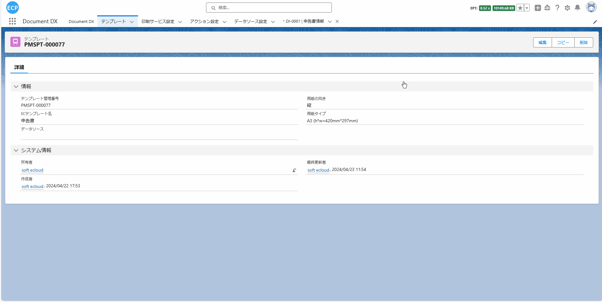
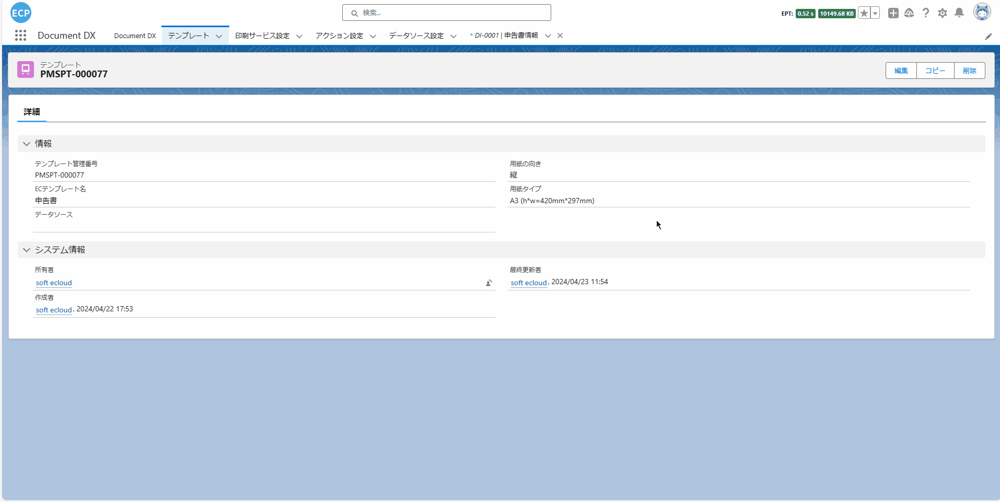
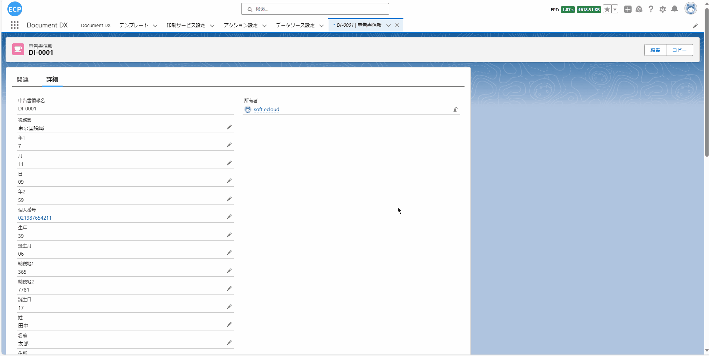

# 申告书

<aside>
💡 通常情况下，申告书用来收集个人或企业的基本信息、财务信息、身份信息、收入来源、资产负债情况及税务信息等。这些信息被税务部门用于评估纳税人的应纳税额和核实纳税情况，同时也被金融机构用于评估信用风险，并决定是否提供如贷款、信用卡等金融服务。因此，设计一个易于填写和提交申报信息的申告书变得至关重要。
</aside>
<br>

# **前提条件：**

- Salesforce AppExchange 中查找我们的应用并安装到环境中。如下图所示：


# **1. 打开设计器**

1.1 通过Home Tab的快速开始或新建模板数据的方式打开设计器。如下图所示：


# **2. 准备报表**

- 2.1 在开始设计过程时，有多种方式可以帮助您创建设计的基础。您可以选择扫描一个现有的报表，从网络上下载一个报表，或者直接从设计工具的模板中心选取一个模板。例如，你可以从模板中心选取一个申告书模板，如下图所示：


# **页眉线和页脚线**

- 页眉线和页脚线功能可查看[请求书](sc-request.md)中的**页眉线和页脚线**。

# **3. 模板的属性设置**

- 3.1 模板的属性设置可查看[请求书](sc-request.md)中的**第3步**。

- 3.2 我们当前使用的申告书模板是采用套打模式实现的。关于套打模式的详细说明，请参考[套打功能](ad-overprinting.md)文档中的**第1至第5步骤**。

- 3.2.1 如果您不想采用套打模式来设计模板，您也可以通过将元素拖拽到面板来设计一个全新的申告书模板。

# **4. 元素的宽高大小设置**

- 4.1 元素的宽高大小设置可查看[请求书](sc-request.md)中的**第4步**。

# **5. 文本元素的属性设置**

- 5.1 文本元素的属性设置可查看[请求书](sc-request.md)中的**第5步**。

# **6. 图片元素的属性设置**

- 6.1 图片元素的属性设置可查看[请求书](sc-request.md)中的**第6步**。

# **7. 辅助元素的属性设置**

- 7.1 辅助元素的属性设置可查看[请求书](sc-request.md)中的**第7步**。

# **8. 表格元素的属性设置**

- 8.1 表格元素的属性设置可查看[请求书](sc-request.md)中的**第8步**。

# **9. 二维码和条形码元素的属性**

- 9.1 二维码和条形码元素的属性设置可查看[请求书](sc-request.md)中的**第9步**。

# **10. 编辑打印数据、查看JSON数据模型、导出、从本地文件导入和预览功能**

- 10.1 编辑打印数据、查看JSON数据模型等功能可查看[请求书](sc-request.md)中的**第10步**。

# **11. 保存模板和查看模板信息**

- 11.1 保存模板和查看模板信息处理可查看[请求书](sc-request.md)中的**第11步**。

# **12. 抽取业务数据**

- 12.1 通过点击查看Apex Class数据模型按钮或通过快捷键(Ctrl / Command + M)打开查看Apex Class数据模型画面，将代码全部复制后点击取消全屏按钮，并打开已保存的模板数据查看模板的信息，复制的代码用于**12.3步骤**创建自定义打印数据返回的对象。如下图所示：


- 12.2 抽取业务数据处理可查看[请求书](sc-request.md)中的**第12步**。

- 12.3 通过**12.1步骤**复制的代码创建一个新的ApexClass文件，用于自定义开发抽取数据后返回的对象。如下图所示：



- 12.4 编辑通过**12.2步骤**新建的Apex Class文件，通过自定义开发，编写SQL抽取业务数据。如下图所示：



- 12.4.1 完整Apex Class代码。如下所示：

```
public with sharing class Demo_Ctrl01 {
    public Demo_Ctrl01 (ApexPages.StandardController controller) {}
    public List<String> templateNames {get; set;}
    public String dataSource { get; set; }
    public String printSeviceName { get; set; }
    public String machineId { get; set; }
    public String printMode { get; set; }
    public List<String> itemIds { get; set; }
    public List<SObject> selectedObjects { get; set; }

    public void initAction() {
        templateNames = new List<String>{'申告書'};
        // カスタム開発ではこのフィールドを設定できます
        dataSource = objectDataToJsonStr();
        printSeviceName = 'Print Cloud Service Config';
        machineId = 'fdcd6b04-9b6e-48b1-8e57-0ee5caf88063';
    }

    private String objectDataToJsonStr () {
        List<eprint__declaration_info__c> declarationInfos = [
            SELECT 
                eprint__tax_office__c,
                eprint__year1__c,
                eprint__month__c,
                eprint__day__c,
                eprint__year2__c,
                eprint__personal_number__c,
                eprint__birth_year__c,
                eprint__birth_month__c,
                eprint__tax_place2__c,
                eprint__birth_day__c,
                eprint__tax_place1__c,
                eprint__surname__c,
                eprint__name__c,
                eprint__address__c,
                eprint__person_name__c,
                eprint__reiwa_year_address__c,
                eprint__occupation__c,
                eprint__house_number__c,
                eprint__head_household_name__c,
                eprint__relationship__c,
                eprint__circle__c,
                eprint__organize_number__c,
                eprint__tel01__c,
                eprint__tel02__c,
                eprint__tel03__c,
                eprint__hoken1__c,
                eprint__hoken3__c,
                eprint__hoken2__c,
                eprint__bank__c,
                eprint__branch__c,
                eprint__hoken_sum__c,
                eprint__post_office_name__c,
                eprint__account__c,
                eprint__account2__c,
                eprint__roster__c,
                eprint__manage__c
            FROM
                // 主表：申告の基本情報
                eprint__declaration_info__c
            WHERE 
                Name = 'DI-0001'
        ];
        List<TemplateProject> templateProjects = new List<TemplateProject>();
        for (eprint__declaration_info__c declarationInfo : declarationInfos) {
            TemplateProject templateProject = new TemplateProject();
            // taxOffice
            templateProject.taxOffice = declarationInfo.eprint__tax_office__c;
            // year1
            templateProject.year1 = declarationInfo.eprint__year1__c;
            // month
            templateProject.month = declarationInfo.eprint__month__c;
            // day
            templateProject.day = declarationInfo.eprint__day__c;
            // year2
            templateProject.year2 = declarationInfo.eprint__year2__c;
            // personalNumber
            templateProject.personalNumber = declarationInfo.eprint__personal_number__c;
            // birthYear
            templateProject.birthYear = declarationInfo.eprint__birth_year__c;
            // birthMonth
            templateProject.birthMonth = declarationInfo.eprint__birth_month__c;
            // taxPlace2
            templateProject.taxPlace2 = declarationInfo.eprint__tax_place2__c;
            // birthDay
            templateProject.birthDay = declarationInfo.eprint__birth_day__c;
            // taxPlace1
            templateProject.taxPlace1 = declarationInfo.eprint__tax_place1__c;
            // surname
            templateProject.surname = declarationInfo.eprint__surname__c;
            // name
            templateProject.name = declarationInfo.eprint__name__c;
            // address
            templateProject.address = declarationInfo.eprint__address__c;
            // personName
            templateProject.personName = declarationInfo.eprint__person_name__c;
            // reiwaYearAddress
            templateProject.reiwaYearAddress = declarationInfo.eprint__reiwa_year_address__c;
            // occupation
            templateProject.occupation = declarationInfo.eprint__occupation__c;
            // houseNumber
            templateProject.houseNumber = declarationInfo.eprint__house_number__c;
            // headHouseholdName
            templateProject.headHouseholdName = declarationInfo.eprint__head_household_name__c;
            // relationship
            templateProject.relationship = declarationInfo.eprint__relationship__c;
            // circle
            templateProject.circle = declarationInfo.eprint__circle__c;
            // organizeNumber
            templateProject.organizeNumber = declarationInfo.eprint__organize_number__c;
            // tel01
            templateProject.tel01 = declarationInfo.eprint__tel01__c;
            // tel02
            templateProject.tel02 = declarationInfo.eprint__tel02__c;
            // tel03
            templateProject.tel03 = declarationInfo.eprint__tel03__c;
            // hoken1
            templateProject.hoken1 = declarationInfo.eprint__hoken1__c;
            // hoken3
            templateProject.hoken3 = declarationInfo.eprint__hoken3__c;
            // hoken2
            templateProject.hoken2 = declarationInfo.eprint__hoken2__c;
            // bank
            templateProject.bank = declarationInfo.eprint__bank__c;
            // branch
            templateProject.branch = declarationInfo.eprint__branch__c;
            // hoken_sum
            templateProject.hoken_sum = String.valueOf(declarationInfo.eprint__hoken_sum__c);
            // postOfficeName
            templateProject.postOfficeName = declarationInfo.eprint__post_office_name__c;
            // account
            templateProject.account = declarationInfo.eprint__account__c;
            // account2
            templateProject.account2 = declarationInfo.eprint__account2__c;
            // roster
            templateProject.roster = declarationInfo.eprint__roster__c;
            // manage
            templateProject.manage = declarationInfo.eprint__manage__c;
            templateProjects.add(templateProject);
        }
        return JSON.serialize(templateProjects);
    }
}
```

# **13. 打印预览和导出PDF**

- 13.1 由于当前模板的纸张大小较大，使用传统的Action按钮可能会导致显示不全。为了解决这个问题，您可以通过'新建按钮或链接'创建一个新的按钮，该按钮将打开Visualforce Page画面，这样您就可以完整地预览模板了。如下图所示：



- 13.2 打印预览和导出PDF处理可查看[请求书](sc-request.md)中的**第13步**。

- 13.3 预览模板最终结果。如下图所示：


