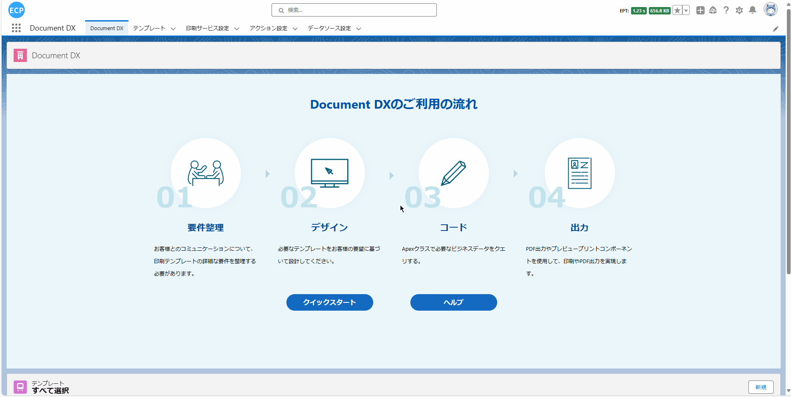
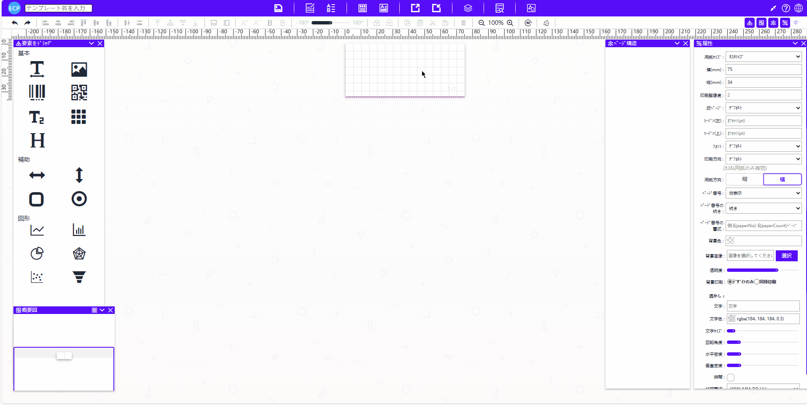
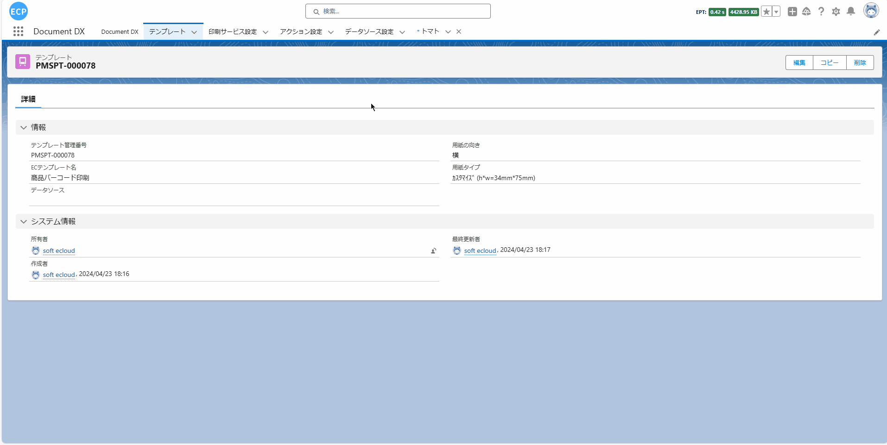
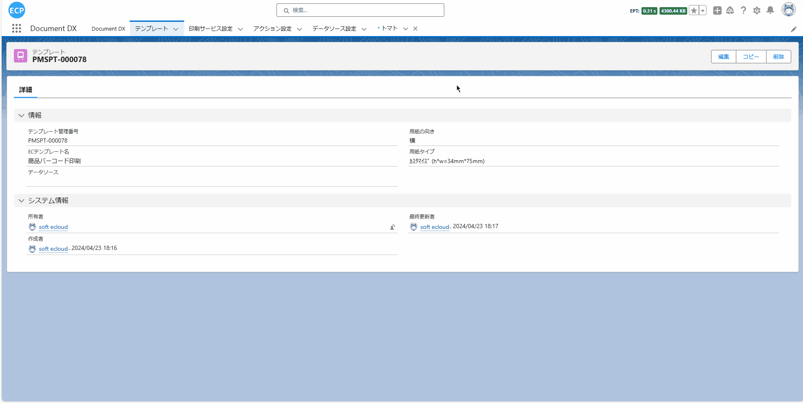
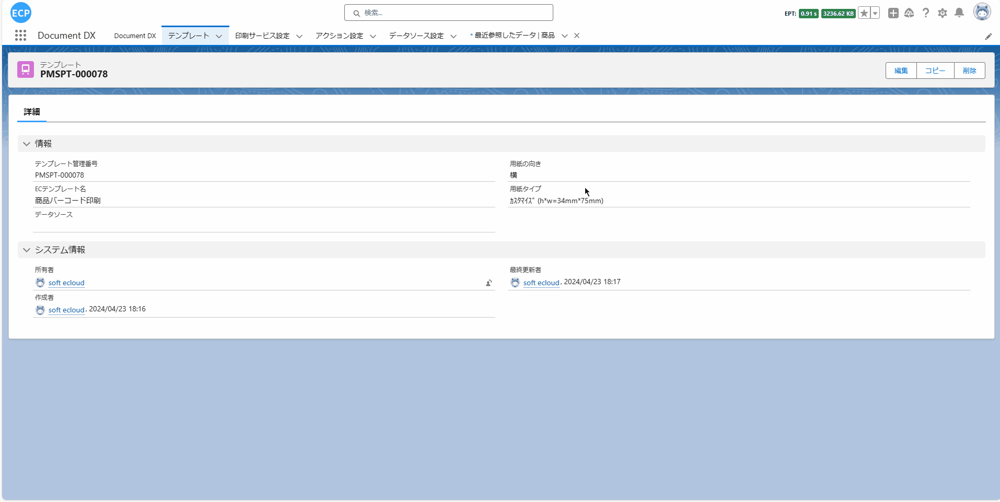
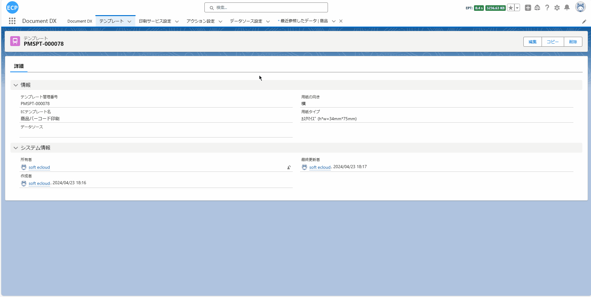

# 商品BARCODE印刷

<aside>
💡 商品条形码（BARCODE）印刷功能允许用户在列表画面中选择多笔数据后进行批量预览打印和导出PDF。这种功能的实现为用户提供了便利，可以在一次操作中处理多个商品条形码的打印和导出，提高了工作效率和操作便捷性。
</aside>
<br>

# **前提条件：**

- Salesforce AppExchange 中查找我们的应用并安装到环境中。如下图所示：


# **1. 打开设计器**

- 1.1 通过Home Tab的快速开始或新建模板数据的方式打开设计器。如下图所示：



# **2. 准备报表**

- 2.1 在开始设计过程时，有多种方式可以帮助您创建设计的基础。您可以选择扫描一个现有的报表，从网络上下载一个报表，或者直接从设计工具的模板中心选取一个模板。当前例子使用新建模板的方式。

# **页眉线和页脚线**

- 页眉线和页脚线功能可查看[请求书](sc-request.md)中的**页眉线和页脚线**。

# **3. 模板的属性设置**

- 3.1 模板的属性设置可查看[请求书](sc-request.md)中的**第3步**。

# **4. 元素的宽高大小设置**

- 4.1 元素的宽高大小设置可查看[请求书](sc-request.md)中的**第4步**。

# **5. 二维码和条形码元素的属性**

- 5.1 添加一个条形码元素和一个文本元素到面板，并设置基本的属性。如下图所示：



# **6. 编辑打印数据、查看JSON数据模型、导出、从本地文件导入和预览功能**

- 6.1 编辑打印数据、查看JSON数据模型等功能可查看[请求书](sc-request.md)中的**第10步**。

# **7. 保存模板和查看模板信息**

- 7.1 保存模板和查看模板信息处理可查看[请求书](sc-request.md)中的**第11步**。

# **8. 通过自定义开发抽取业务数据**

- 8.1 通过点击查看Apex Class数据模型按钮或通过快捷键(Ctrl / Command + M)打开查看Apex Class数据模型画面，将代码全部复制后点击取消全屏按钮，并打开已保存的模板数据查看模板的信息，复制的代码用于**8.3步骤**创建自定义打印数据返回的对象。如下图所示：


- 8.2 您可以点击'动作设置' Tab，配置已经创建完成的模板，并选择在List画面进行预览打印。如下图所示：



- 8.3 抽取业务数据处理可查看[请求书](sc-request.md)中的**第12步**。

- 8.4 通过**8.1步骤**复制的代码创建一个新的ApexClass文件，用于自定义开发抽取数据后返回的对象。如下图所示：



- 8.5 编辑通过**8.3步骤**新建的Apex Class文件，通过自定义开发，编写SQL抽取业务数据。如下图所示：



- 8.5.1 完整Apex Class代码。如下所示：

```
public with sharing class Demo_Ctrl01 {
    public Demo_Ctrl01 (ApexPages.StandardSetController  controller) {
    selectedObjects = controller.getSelected();
  }
    public List<String> templateNames {get; set;}
    public String dataSource { get; set; }
    public String printSeviceName { get; set; }
    public String machineId { get; set; }
    public String printMode { get; set; }
    public List<String> itemIds { get; set; }
    public List<SObject> selectedObjects { get; set; }
    public String sObjectId { get; set; }

    public void initAction() {
        templateNames = new List<String>{'商品バーコード印刷'};
        itemIds = new List<String>();
        for(SObject obj : selectedObjects ){
            itemIds.add(obj.Id);
        }
        // カスタム開発ではこのフィールドを設定できます
        dataSource = objectDataToJsonStr(itemIds);
        printSeviceName = 'Print Cloud Service Config';
        machineId = 'fdcd6b04-9b6e-48b1-8e57-0ee5caf88063';
    }

    private String objectDataToJsonStr(List<String> itemIds) {
        List<Product2> products = [
            SELECT 
                Name,
                ProductCode
            FROM
                // 商品
                Product2
            WHERE 
                Id IN :itemIds
        ];
        List<TemplateProject> templateProjects = new List<TemplateProject>();
        for (Product2 product : products) {
            TemplateProject templateProject = new TemplateProject();
            // 商品名
            templateProject.productName = product.Name;
            // バーコード
            templateProject.barCode = product.ProductCode;
            templateProjects.add(templateProject);
        }
        return JSON.serialize(templateProjects);
    }
}
```

# **9. 打印预览和导出PDF**

- 9.1 打印预览和导出PDF处理可查看[请求书](sc-request.md)中的**第13步**。

- 9.2 添加List批量打印按钮。如下图所示：


- 9.3 List画面选择多笔数据后预览模板结果。如下图所示：



- 9.4 List画面选择单笔数据后预览模板结果。如下图所示：

