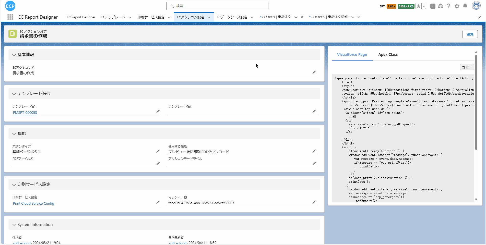
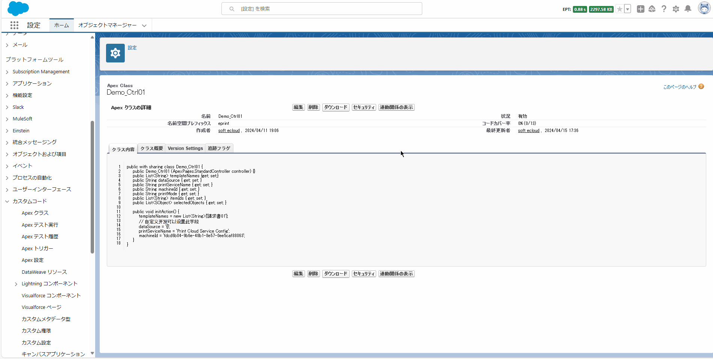
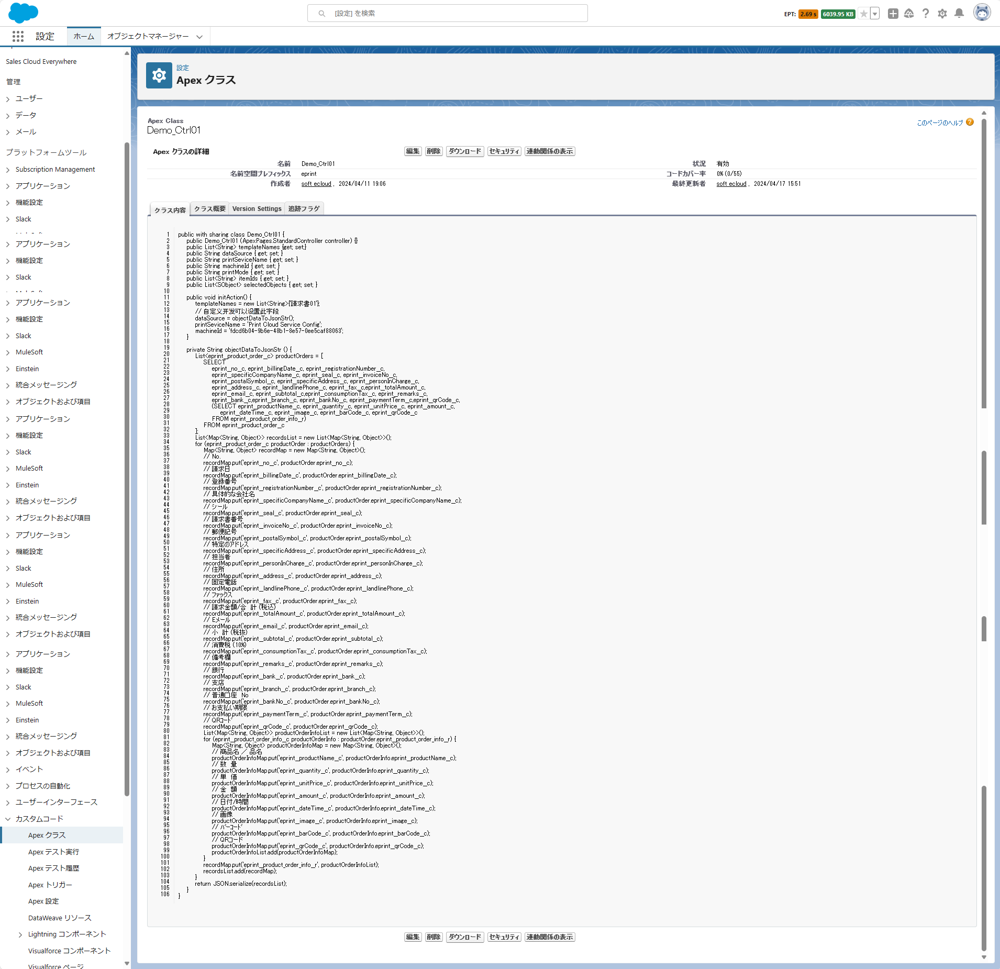

# 请求书

<aside>
💡 设计请求书需要通过一系列细致和有序的步骤来完成。首先，我们需要准备相关的报表，并确定要展示的关键信息内容与优先级。然后在设计工具中设定纸张大小和边距参数，确定内容的布局，以及选择符合品牌主题的颜色。之后，开始输入并设计文本，添加适当的图形元素以增强视觉效果，也可以考虑将公司或团队的徽标融入设计中。完成初步设计后，进行预览并做必要的调整来确保设计符合预期。最后，打印出实物进行效果检查，并根据反馈进行必要的优化调整。
</aside>
 

# **前提条件：**

- Salesforce AppExchange 中查找我们的应用并安装到环境中。如下图所示：

# **1. 打开设计器**

1.1 通过Home Tab的快速开始或新建模板数据的方式打开设计器。如下图所示：

# **2. 准备报表**

- 2.1 在开始设计过程时，有多种方式可以帮助您创建设计的基础。您可以选择扫描一个现有的报表，从网络上下载一个报表，或者直接从设计工具的模板中心选取一个模板。例如，你可以从模板中心选取一个请求书模板，如下图所示：

# **页眉线和页脚线**

- 页眉线和页脚线的功能能使得页眉和页脚内的元素在每一页都显示。然而，如果表格元素显示在页眉或页脚内，可能会导致表格的自动分页功能失效。如下图所示：

# **3. 模板的属性设置**

- 3.1 在设计工具中，可以进行纸张大小和边距的设定。您可以选择事先设定好的纸张大小，也可以自定义纸张大小，只需修改纸张的宽和高。如下图所示：

- 3.2 打印清晰度设置值越大则导出的PDF清晰度越高。

- 3.3 可以适当的设置边距以优化布局。如下图所示：

- 3.4 如果当前模板的字体与您预期的不一致，您可以在设计工具中进行调整。例如，您可以将字体设置为cursive。如下图所示：

- 3.5 您可以调整页码的显示设置，比如决定是否显示页码，或者自定义页码显示的格式。如下图所示：

- 3.6 如果您所设计的报表需要具有一种特定的背景色，那么您可以通过背景颜色设置来实现这一目标。

- 3.7 如果您想要使用[套打功能](ad-overprinting.md)，或者您所设计的报表需要添加背景图片，那么您都可以通过背景图片设定来实现这一目标。需要注意的是，本地上传的图片大小**最大支持512KB**。如果**图片超过了512KB**，您仍然可以通过**输入图片链接**的方式来正常显示图片。如下图所示：

- 3.8 如果您需要在设计的模板中添加水印，您可以使用水印功能来实现这一目标。如下图所示：

# **4. 元素的宽高大小设置**

- 4.1 如果元素的大小不符合您的预期，您可以通过点击并拖拽元素的边框来调整其大小。如下图所示：

- 4.2 您也可以通过调整元素基础属性中的宽高大小来改变其大小。如下图所示：

# **5. 文本元素的属性设置**

#### **基础**

- 5.1 设置了字段名后，可以在提取业务数据时与数据字段进行绑定。这样在预览时，抽取出的数据可以通过绑定关系找到对应的元素进行展示。此外，设置好字段名后，也可以在测试数据中输入您的业务数据，以检验元素的设置是否正确。如下图所示：

- 5.2 元素的标题默认是会显示的。如果您不希望显示元素的标题，可以选择将其隐藏。如下图所示：

#### **样式**

- 5.3 您可以为当前的文本元素指定数据类型，并设置相应的数据格式。如果预设的数据格式不满足您的需求，您也可以手动自定义数据格式。如下图所示：

- 5.4 您可以为当前的文本元素设置字体，包括字体大小、粗细、颜色、和字间距等属性。如下图所示：

- 5.5 背景颜色：您可以使用色彩选择器来设定当前元素的背景颜色。为了效果最佳，应选择与内容相匹配且适合品牌或主题的颜色

- 5.6 文本修饰：您可以给当前元素中的数据添加如下划线、上划线或者删除线等修饰效果。

- 5.7 文本换行：如果当前元素的值长度会超出元素的定义长度，您可以为该元素设置文本换行方式。目前默认设置是自动换行，但您也可以选择'不换行'、'不换行&隐藏'或'不换行&省略'等选项。如下图所示：

#### **边框**

- 5.8 边框设置：您可以为当前元素添加上、下、左、右四个方向的边框，并可以设定边框的粗细和颜色。同时，您也可以调整元素内部数据跟边框之间在上、下、左、右四个方向的边距。

#### **高级**

- 5.9 显示规则和隐藏规则：您可以为当前元素设定特定的显示和隐藏规则。例如，您可以设置该元素仅在奇数页显示，或者在首页不显示。

- 5.10 拖动方向：您可以设定当前元素的拖动方向。比如，您可以设定该元素只能进行横向拖动，避免拖动时竖向位置发生变化。

# **6. 图片元素的属性设置**

#### **基础**

- 6.1 设置字段名后，可以在提取业务数据时绑定到数据字段。这使得在预览时，可以找到与抽取数据相对应的元素进行展示。另外，在设置好字段名后，如果需要增加图片，可以选择上传本地图片或使用图片链接。但需要注意的是，本地上传的图片**大小不能超过512KB**，如果图片超过了这一大小，推荐使用图片链接。如下图所示：

- 6.2 显示规则和隐藏规则：您可以为当前元素设定特定的显示和隐藏规则。例如，您可以设置该元素仅在奇数页显示，或者在首页不显示。

#### **样式**

- 6.3 您可以通过调整'旋转角度'来改变元素的方向。系统支持从-180度到180度的调整范围。

- 6.4 元素层级设置用于决定元素在重叠时的显示优先级，设置值越大的元素其层级越高，相应地也将显示在更上层。

#### **高级**

- 6.5 拖动方向：您可以设定当前元素的拖动方向。比如，您可以设定该元素只能进行横向拖动，避免拖动时竖向位置发生变化。

# **7. 辅助元素的属性设置**

#### **基础**

- 7.1 显示规则：您可以为当前元素设定特定的显示规则。例如，您可以设置该元素仅在奇数页显示。

#### **样式**

- 7.2 线宽、线样式和线颜色设置：您可以为辅助图形设定具体的线宽、线的样式（例如：虚线或实线），以及线的颜色。如下图所示：

#### **高级**

- 7.3 拖动方向：您可以设定当前元素的拖动方向。比如，您可以设定该元素只能进行横向拖动，避免拖动时竖向位置发生变化。

# **8. 表格元素的属性设置**

#### **基础**

- 8.1 设置了字段名后，您可以在提取业务数据时将其与数据字段进行绑定。这样，在预览时，抽取出的数据可以通过绑定关系找到并显示相应的元素。此外，当字段名设置好后，您也可以在测试数据中输入自己的业务数据，以检验元素的设置是否正确。需要注意的是，表格的测试数据应采用JSON格式。如下图所示：

- 8.2 表格头显示设置和表格脚显示设置：您可以设定表格头和表格脚的显示条件。比如，您可以选择仅在首页显示表格头，而在最后一页显示表格脚。

- 8.3 默认情况下，表格的自动补全功能是关闭的。当您将其设置为打开时，预览打印或下载PDF时，系统会将表格下方的剩余部分自动填充为空白行。

- 8.4 通过设定每页最大行数，您可以控制表格的数据在每一页上显示的最大条目数量。

- 8.5 在表格基础属性的最下方，您可以看到当前表格的所有列。通过取消勾选框，您可以隐藏该列，而选中勾选框则会使该列在表格中显示。

#### **样式**

- 8.6 您可以为整个表格单独设置字体、字体大小、字体行高等属性。

- 8.7 一行多组与一行多组间隔设置：您可以选择将当前表格设定为一行显示两列、三列或四列。虽然表格被拆分显示，但是数据源保持不变。比如，当您设定表格为一行两列显示后，表格将被分为两个子表格。此时，如果您将一行多组间隔设为10，那么这两个子表格将会被隔开显示。如下图所示：

- 8.8 您可以分别设置表头的背景颜色，表体数据的奇偶行颜色，以及表格边框的颜色。如下图所示：

- 8.9 固定行高设置：当设定为固定时，表格的行高将按照表体行高的设定来显示，超出行高范围的内容会自动隐藏。注意，默认情况下，如果数据超出单元格，会自动进行换行展示。如下图所示：

- 8.10 您可以设定表体行边框和表体单元格边框为虚线。表体行边框的设置会使表体内部的行边框显示为虚线，而表体单元格边框的设置则会使表体内部的列边框显示为虚线。如下图所示：

- 8.11 元素层级设置用于决定元素在重叠时的显示优先级，设置值越大的元素其层级越高，相应地也将显示在更上层。

#### **列**

- 8.12 标题：输入的标题将作为当前列的说明。

- 8.13 设置了列字段名后，您可以在提取业务数据时将其与数据字段进行绑定。这样，在预览时，抽取出的数据可以通过绑定关系找到并显示相应的表格列中。

- 8.14 您可以设定表体中单元格的左右对齐方式。如下图所示：

- 8.15 您可以设定表头单元格的左右对齐方式。如下图所示：

- 8.16 您可以设定表头单元格的上下对齐方式。如下图所示：

- 8.17 您可以为单元格设定各种字段类型，包括：文本、数值、日期时间、序号、条形码、二维码和图片。同时，针对不同类型，您还可以设置相应的格式化方式。比如，对于数值和日期时间，除了选择已有的格式外，还可以输入自定义的格式。如下图所示：

- 8.17.1 序号、文本：

- 8.17.2 数值、日期时间：

- 8.17.3 条形码、二维码：

- 8.17.4 图片：

- 8.18 单元格高度：当表格中包含二维码、条形码或者图片列时，您可以为这些列设定单元格高度。一旦设定，二维码、条形码和图片将按照您设定的单元格高度展示。需要注意的是，如果想要二维码和条形码居中显示需要确保单元格高度小于表体行高。如下图所示：

- 8.19 左内边距和右内边距设置：您可以设定单元格数据与左侧和右侧边框的距离。如下图所示：

- 8.20 底部聚合标题和底部聚合文本：聚合标题默认设置为显示，如果您只需要显示结果，可以将其设置为隐藏。当聚合标题显示时，您可以通过设置聚合文本来自定义聚合标题的显示内容。如下图所示：

- 8.21 底部聚合合并列数：您可以通过设置这个值来决定从当前列开始，向后合并多少列来显示集计结果。

- 8.22 底部聚合类型、底部聚合类型的左右对齐和底部聚合类型的小数位数：您可以选择要进行的集计类型，包括：计数、合计、平均值、最大值和最小值。设置了聚合类型后，您可以通过设定左右对齐来调整集计单元格的对齐方式。另外，您还可以选择集计结果需要保留多少位小数。如下图所示：

#### **高级**

- 8.23 拖动方向：您可以设定当前元素的拖动方向。比如，您可以设定该元素只能进行横向拖动，避免拖动时竖向位置发生变化。

# **9. 二维码和条形码元素的属性**

#### **基础**

- 9.1 设置了字段名后您就可以在提取业务数据时将其与数据字段进行绑定。这样，当您预览时，抽取出的数据可以通过其绑定关系找到并显示相应的元素。此外，设置好字段名后，您还可以在测试数据中输入您的业务数据，以此来验证元素设置的正确性。如下图所示：

- 9.2 对于二维码元素，其标题不会显示，而条形码元素的标题则会默认显示。如果您不希望显示条形码元素的标题，可以选择将其隐藏。

#### **样式**

- 9.3 您可以通过调整'旋转角度'来改变元素的方向。系统支持从-180度到180度的调整范围。

- 9.4 元素层级设置用于决定元素在重叠时的显示优先级，设置值越大的元素其层级越高，相应地也将显示在更上层。

#### **高级**

- 9.5 打印类型会根据当前元素的类型自动选择。例如，如果当前元素是二维码，那么打印类型就会默认设置为二维码。您也可以手动设置为其他类型，如：文本或条形码。

- 9.6 条形码格式：您可以选择多种不同的条形码格式。

- 9.7 二维码容错率：这是指二维码在被扫描时能够容忍的错误和损坏的程度。通常以百分比表示，代表二维码中允许存在的错误比例。容错率越高，二维码能够承受的错误就越多。然而，需要注意的是，容错率越高，二维码的密度就会越低，因为一部分空间需要用于错误修复。因此，如果希望提高容错率，可能需要相应地增加二维码的尺寸，以容纳更多的错误修正信息。

# **10. 编辑打印数据、查看JSON数据模型、导出、从本地文件导入和预览功能**

- 10.1 如果您已经创建了自定义业务对象并了解其数据模型，那么就可以提取数据（请注意，数据格式应为JSON）并设置到“编辑打印数据”中。只需点击“预览”，就可以查看携带数据的模板。如下图所示：

- 10.2 您也可以点击'查看JSON数据模型'按钮。这会将当前模板中设定了字段名的元素整合成一个JSON对象，其中'key'就是您设定的字段名。

- 10.3 您还可以点击'导出'按钮，将当前的模板保存至本地，需要注意的是，导出的文件格式为JSON。

- 10.4 您也可以点击'导入'按钮，通过这种方式，设计器会从您本地的JSON文件中读取数据并显示。

- 10.5 设定打印数据并点击“预览”后，您可以查看携带数据的模板。此时，您可以对比模板与预期的设计是否一致。如果有不符合预期的地方，可以关闭预览界面，回到设计器中进行微调。当然，您也可以在设计途中点击预览按钮查看设计的模板是否符合预期。一旦确认模板设计无误，您可以点击“导出PDF”，将当前模板保存为PDF文件。同时，也可以点击“浏览器打印”直接打印模板。

# **11. 保存模板和查看模板信息**

- 11.1 在左上角输入模板名称后，可以通过点击顶部的'保存'按钮，或使用快捷键 ('Ctrl'或'Command' + 'S')来保存当前的模板。请注意，模板名称不能与已保存的模板名称重复。如下图所示：

- 11.2 模板保存成功后可以点击EC模板Tab，将"最近查看的数据（固定列表）"修改为"全选"后即可查看到保存的模板。如下图所示：

# **12. 抽取业务数据**

- 12.1 首先，您需要找到要抽取业务数据的对象。如下图所示：

- 12.2 按照 [预览打印、直接打印](ad-print.md)中的1至2步来配置预览打印信息和新建Apex Class文件和Visualforce Page文件。

- 12.3 设定信息、ApexClass和VisualforcePage文件信息。如下图所示：

- 12.3.1 设定信息：模板名称选择11.2步骤中的模板编号，使用功能部分选择：'模板预览后打印'和'PDF下载'。

- 12.3.2 ApexClass：代码中的dataSource就是展示在模板中的数据

- 12.3.3 VisualforcePage：代码中的standardcontroller要设置为当前抽取数据的对象API名，extensions设置为12.3.2步骤的ApexClass名。

- 12.4 编辑新建的Apex Class文件，通过自定义开发，编写SQL抽取业务数据。如下图所示：

- 12.4.1 完整Apex Class代码。如下图所示：

# **13. 打印预览和导出PDF**

- 13.1 首先，您需要按照 [预览打印、直接打印](ad-print.md)中的第3步来配置预览的按钮。

- 13.2 抽取数据的代码和预览的按钮添加完成后，即可在业务对象的详细数据中查看到预览按钮。如下图所示：

- 13.3 点击预览按钮，您可查看带有数据的模板。点击打印，则可以将当前的模板连同数据一起打印出来。点击下载，会将当前的模板以及附带的数据导出为PDF文件。如下图所示：
注：打印需要确保已经连接了打印客户端，如没有连接可先看[预览打印、直接打印](ad-print.md)的步骤7

