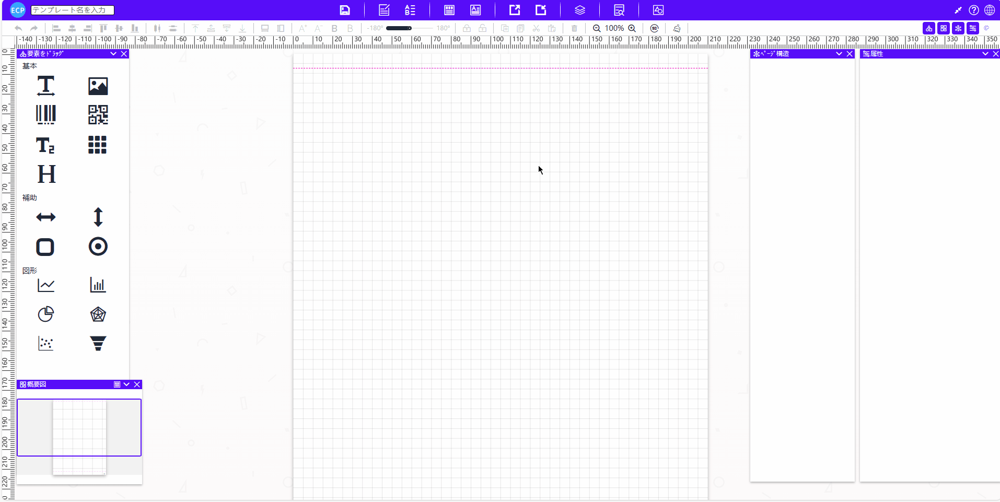
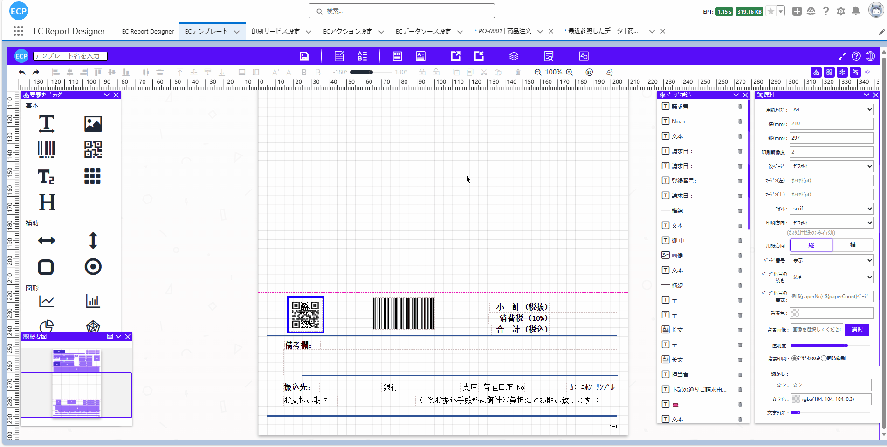
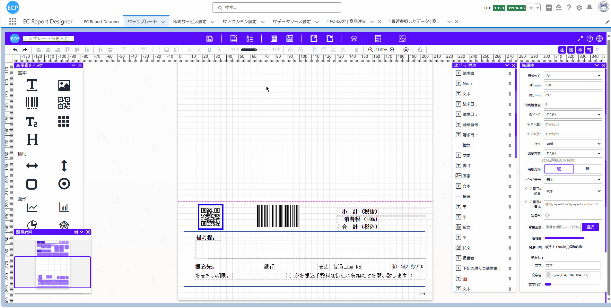
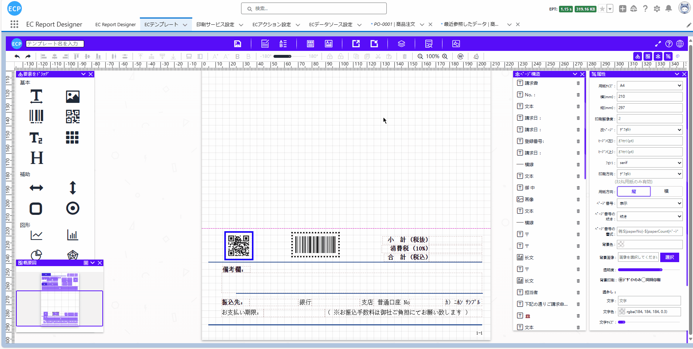
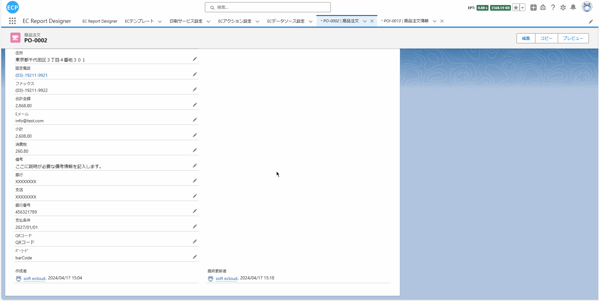
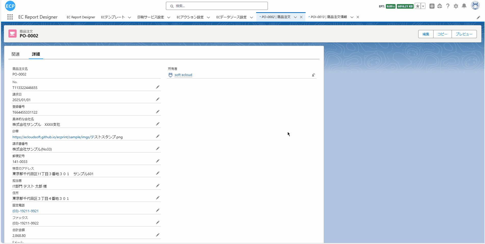
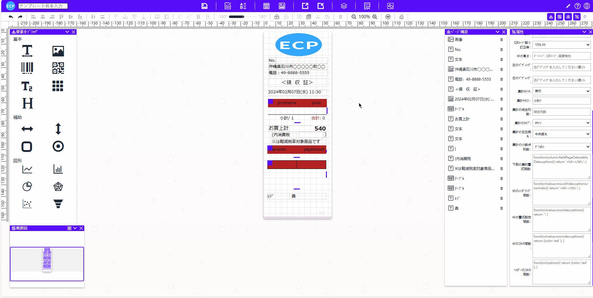
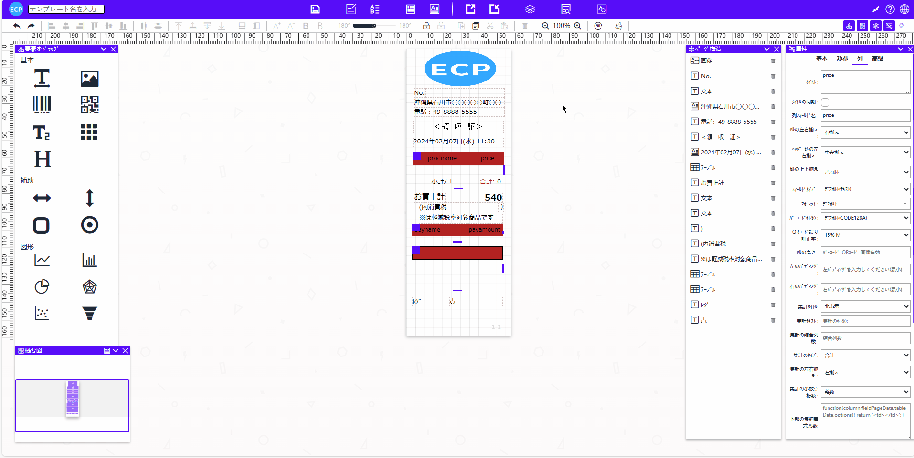
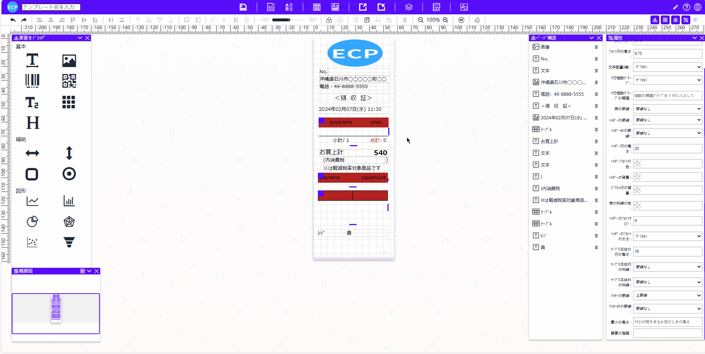

# 购物小票

<aside>
💡 购物小票在零售行业中扮演着重要角色。当顾客在商店购买商品时，购物小票会提供详细的购买信息，包括商品清单、价格、购买日期等。这不仅帮助顾客核对购买内容，还为后续的退换货服务提供了便利。
</aside>
 

# **前提条件：**

- Salesforce AppExchange 中查找我们的应用并安装到环境中。如下图所示：

# **1. 打开设计器**

1.1 通过Home Tab的快速开始或新建模板数据的方式打开设计器。如下图所示：

# **2. 准备报表**

- 2.1 在开始设计过程时，有多种方式可以帮助您创建设计的基础。您可以选择扫描一个现有的报表，从网络上下载一个报表，或者直接从设计工具的模板中心选取一个模板。例如，你可以从模板中心选取一个购物小票模板，如下图所示：

# **页眉线和页脚线**

- 页眉线和页脚线功能可查看[请求书](sc-request.md)中的**页眉线和页脚线**。

# **3. 模板的属性设置**

- 3.1 模板的属性设置可查看[请求书](sc-request.md)中的**第3步**。

- 3.2 默认情况下，当数据较多时，系统会自动进行分页显示。然而，通常情况下，购物小票模板是不需要进行分页显示的。所以，如果您希望在数据较多的情况下不进行分页显示，您需要在面板属性中将'分页规则'修改为'不分页'。如下图所示：

# **4. 元素的宽高大小设置**

- 4.1 元素的宽高大小设置可查看[请求书](sc-request.md)中的**第4步**。

# **5. 文本元素的属性设置**

- 5.1 文本元素的属性设置可查看[请求书](sc-request.md)中的**第5步**。

# **6. 图片元素的属性设置**

- 6.1 图片元素的属性设置可查看[请求书](sc-request.md)中的**第6步**。

# **7. 编辑表格元素**

- 7.1 通常情况下，购物小票模板中的商品信息列表是不需要显示表头的，除非需要进行集计，否则表尾也无需显示。在这种情况下，您可以在表格基础属性中设置'表格头显示'和'表格脚显示'。默认为显示，如果您不希望它们显示，可以将这两个属性设置为不显示。如下图所示：

- 7.2 如果您希望计算商品信息表格中价格的合计、平均值等，可以设置想要计算的表格列的底部聚合类型。您可以决定是否显示底部聚合标题，也可以自定义底部聚合标题。此外，您还可以设定底部聚合单元格是否需要与其他列合并，以及底部聚合单元格的左右对齐方式等。

- 7.2.1 您可以进行底部聚合类型、底部聚合标题以及底部聚合文本的设定。**请注意，只有设置了底部聚合类型后，底部聚合标题才会显示。**如下图所示：

- 7.2.2 您可以设定'底部聚合合并列数'，从当前列的单元格开始向后合并的单元格数。如下图所示：

- 7.2.3 您可以设定'底部聚合类型左右对齐'，这可以指定当前聚合单元格的左右对齐方式。如下图所示：

- 7.2.4 如果计算的结果包含小数，您可以通过设置'底部聚合小数'来决定保留多少位小数，或者只保留整数部分。如下图所示：

- 7.3 通常情况下，购物小票的表格元素边框需要隐藏。表格元素的边框默认是显示的。如果您想要隐藏表格边框，可以在表格样式属性中设置表格边框、表头边框、表头单元格边框、表体行边框、表体单元格边框、表尾边框和表尾单元格边框来实现这一功能。

- 7.3.1 表格边框、表头边框和表头单元格边框设定。如下图所示：

- 7.3.2 表体行边框和表体单元格边框设定。如下图所示：

- 7.3.3 表尾边框和表尾单元格边框设定。如下图所示：

# **8. 编辑打印数据、查看JSON数据模型、导出、从本地文件导入和预览功能**

- 8.1 编辑打印数据、查看JSON数据模型等功能可查看[请求书](sc-request.md)中的**第10步**。

# **9. 保存模板和查看模板信息**

- 9.1 保存模板和查看模板信息处理可查看[请求书](sc-request.md)中的**第11步**。

# **10. 抽取业务数据**

- 10.1 抽取业务数据处理可查看[请求书](sc-request.md)中的**第12步**。
