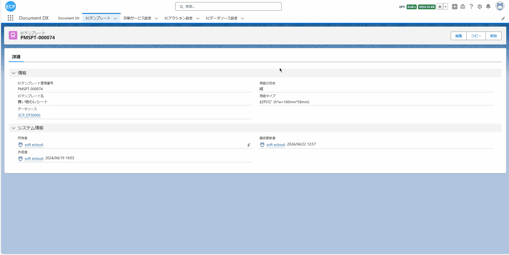
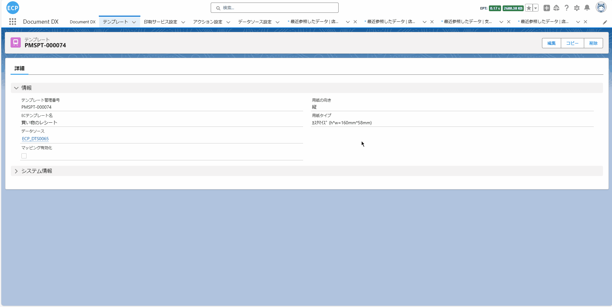
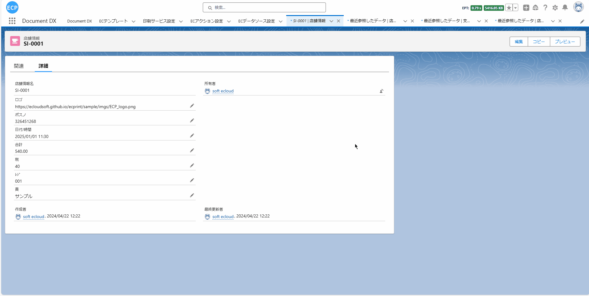

# 购物小票

<aside>
💡 购物小票在零售行业中扮演着重要角色。当顾客在商店购买商品时，购物小票会提供详细的购买信息，包括商品清单、价格、购买日期等。这不仅帮助顾客核对购买内容，还为后续的退换货服务提供了便利。
</aside>
<br>

# **前提条件：**

- Salesforce AppExchange 中查找我们的应用并安装到环境中。如下图所示：


# **1. 打开设计器**

1.1 通过Home Tab的快速开始或新建模板数据的方式打开设计器。如下图所示：


# **2. 准备报表**

- 2.1 在开始设计过程时，有多种方式可以帮助您创建设计的基础。您可以选择扫描一个现有的报表，从网络上下载一个报表，或者直接从设计工具的模板中心选取一个模板。例如，你可以从模板中心选取一个购物小票模板，如下图所示：


# **页眉线和页脚线**

- 页眉线和页脚线功能可查看[请求书](sc-request.md)中的**页眉线和页脚线**。

# **3. 模板的属性设置**

- 3.1 模板的属性设置可查看[请求书](sc-request.md)中的**第3步**。

- 3.2 默认情况下，当数据较多时，系统会自动进行分页显示。然而，通常情况下，购物小票模板是不需要进行分页显示的。所以，如果您希望在数据较多的情况下不进行分页显示，您需要在面板属性中将'分页规则'修改为'不分页'。如下图所示：


# **4. 元素的宽高大小设置**

- 4.1 元素的宽高大小设置可查看[请求书](sc-request.md)中的**第4步**。

# **5. 文本元素的属性设置**

- 5.1 文本元素的属性设置可查看[请求书](sc-request.md)中的**第5步**。

# **6. 图片元素的属性设置**

- 6.1 图片元素的属性设置可查看[请求书](sc-request.md)中的**第6步**。

# **7. 编辑表格元素**

- 7.1 通常情况下，购物小票模板中的商品信息列表是不需要显示表头的，除非需要进行集计，否则表尾也无需显示。在这种情况下，您可以在表格基础属性中设置'表格头显示'和'表格脚显示'。默认为显示，如果您不希望它们显示，可以将这两个属性设置为不显示。如下图所示：


- 7.2 如果您希望计算商品信息表格中价格的合计、平均值等，可以设置想要计算的表格列的底部聚合类型。您可以决定是否显示底部聚合标题，也可以自定义底部聚合标题。此外，您还可以设定底部聚合单元格是否需要与其他列合并，以及底部聚合单元格的左右对齐方式等。

- 7.2.1 您可以进行底部聚合类型、底部聚合标题以及底部聚合文本的设定。**请注意，只有设置了底部聚合类型后，底部聚合标题才会显示。**如下图所示：


- 7.2.2 您可以设定'底部聚合合并列数'，从当前列的单元格开始向后合并的单元格数。如下图所示：


- 7.2.3 您可以设定'底部聚合类型左右对齐'，这可以指定当前聚合单元格的左右对齐方式。如下图所示：


- 7.2.4 如果计算的结果包含小数，您可以通过设置'底部聚合小数'来决定保留多少位小数，或者只保留整数部分。如下图所示：


- 7.3 通常情况下，购物小票的表格元素边框需要隐藏。表格元素的边框默认是显示的。如果您想要隐藏表格边框，可以在表格样式属性中设置表格边框、表头边框、表头单元格边框、表体行边框、表体单元格边框、表尾边框和表尾单元格边框来实现这一功能。

- 7.3.1 表格边框、表头边框和表头单元格边框设定。如下图所示：


- 7.3.2 表体行边框和表体单元格边框设定。如下图所示：


- 7.3.3 表尾边框和表尾单元格边框设定。如下图所示：


# **8. 编辑打印数据、查看JSON数据模型、导出、从本地文件导入和预览功能**

- 8.1 编辑打印数据、查看JSON数据模型等功能可查看[请求书](sc-request.md)中的**第10步**。

# **9. 保存模板和查看模板信息**

- 9.1 保存模板和查看模板信息处理可查看[请求书](sc-request.md)中的**第11步**。

# **10. 抽取业务数据**

- 10.1 通过点击查看Apex Class数据模型按钮或通过快捷键(Ctrl / Command + M)打开查看Apex Class数据模型画面，将代码全部复制后点击取消全屏按钮，并打开已保存的模板数据查看模板的信息，复制的代码用于**10.3步骤**创建自定义打印数据返回的对象。如下图所示：


- 10.2 抽取业务数据处理可查看[请求书](sc-request.md)中的**第12步**。

- 10.3 通过**10.1步骤**复制的代码创建一个新的ApexClass文件，用于自定义开发抽取数据后返回的对象。如下图所示：



- 10.4 编辑通过**10.2步骤**新建的Apex Class文件，通过自定义开发，编写SQL抽取业务数据。如下图所示：



- 10.4.1 完整Apex Class代码。如下所示：

```
public with sharing class Demo_Ctrl01 {
    public Demo_Ctrl01 (ApexPages.StandardController controller) {}
    public List<String> templateNames {get; set;}
    public String dataSource { get; set; }
    public String printSeviceName { get; set; }
    public String machineId { get; set; }
    public String printMode { get; set; }
    public List<String> itemIds { get; set; }
    public List<SObject> selectedObjects { get; set; }

    public void initAction() {
        templateNames = new List<String>{'買い物のレシート'};
        // カスタム開発ではこのフィールドを設定できます
        dataSource = objectDataToJsonStr();
        printSeviceName = 'Print Cloud Service Config';
        machineId = 'fdcd6b04-9b6e-48b1-8e57-0ee5caf88063';
    }

    private String objectDataToJsonStr () {
        List<eprint__store_info__c> storeInfos = [
            SELECT 
                eprint__logo__c,
                eprint__posno__c,
                eprint__dt__c,
                eprint__total__c,
                eprint__tax__c,
                eprint__regno__c,
                eprint__charge__c,
                (
                    SELECT 
                        eprint__prodname__c, 
                        eprint__price__c
                    FROM 
                        eprint_store_product_info__r
                ),
                (
                    SELECT 
                        eprint__payname__c, 
                        eprint__payamount__c
                    FROM 
                        eprint_payment_method__r
                ),
                (
                    SELECT 
                        eprint__content__c, 
                        eprint__url__c
                    FROM 
                        eprint_store_events__r
                )
            FROM 
                eprint__store_info__c
            WHERE 
                Name = 'SI-0001'
        ];
        List<TemplateProject> templateProjects = new List<TemplateProject>();
        for (eprint__store_info__c storeInfo : storeInfos) {
            TemplateProject templateProject = new TemplateProject();
            // ロゴ
            templateProject.logo = storeInfo.eprint__logo__c;
            // ポスノ
            templateProject.posno = storeInfo.eprint__posno__c;
            // 日付/時間
            templateProject.dt = String.valueOf(storeInfo.eprint__dt__c);
            // 合計
            templateProject.total = String.valueOf(storeInfo.eprint__total__c);
            // 税
            templateProject.tax = String.valueOf(storeInfo.eprint__tax__c);
            // ﾚｼﾞ
            templateProject.regno = storeInfo.eprint__regno__c;
            // 責
            templateProject.charge = storeInfo.eprint__charge__c;
            // prods を初期化する
            templateProject.prods = new List<TemplateProject.prodsClass>();
            for (eprint__store_product_info__c storeProductInfo : storeInfo.eprint_store_product_info__r) {
                // prodsClass を初期化する
                TemplateProject.prodsClass prodsClass = new TemplateProject.prodsClass(); 
                // 商品名
                prodsClass.prodname = storeProductInfo.eprint__prodname__c;
                // 価格
                prodsClass.price = String.valueOf(storeProductInfo.eprint__price__c);
                // 各prodsClassを prods に追加します
                templateProject.prods.add(prodsClass);
            }
            // paylist を初期化する
            templateProject.paylist = new List<TemplateProject.paylistClass>();
            for (eprint__payment_method__c paymentMethodInfo : storeInfo.eprint_payment_method__r) {
                // paylistClass を初期化する
                TemplateProject.paylistClass paylistClass = new TemplateProject.paylistClass(); 
                // 支払い名
                paylistClass.payname = paymentMethodInfo.eprint__payname__c;
                // 支払額
                paylistClass.payamount = String.valueOf(paymentMethodInfo.eprint__payamount__c);
                // 各paylistClassを paylist に追加します
                templateProject.paylist.add(paylistClass);
            }
            // campaign を初期化する
            templateProject.campaign = new List<TemplateProject.campaignClass>();
            for (eprint__store_events__c storeEventsInfo : storeInfo.eprint_store_events__r) {
                // campaign を初期化する
                TemplateProject.campaignClass campaignClass = new TemplateProject.campaignClass(); 
                // コンテンツ
                campaignClass.content = storeEventsInfo.eprint__content__c;
                // URL
                campaignClass.url = storeEventsInfo.eprint__url__c;
                // 各campaignClassを campaign に追加します
                templateProject.campaign.add(campaignClass);
            }
            templateProjects.add(templateProject);
        }
        return JSON.serialize(templateProjects);
    }
}
```

# **11. 打印预览和导出PDF**

- 11.1 打印预览和导出PDF处理可查看[请求书](sc-request.md)中的**第13步**。

- 11.2 预览模板最终结果。如下图所示：


